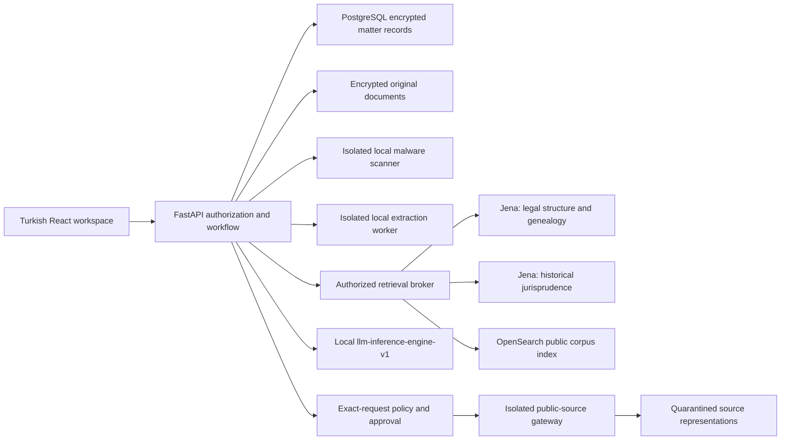

# Türkiye Legal Assistant

A Turkish-first, local legal preparation workspace with two linked knowledge graphs. This repository implements the initial application and ontology engineering baseline of the approved 30–36 week roadmap. **It is not a qualified legal-advice product or a populated, legally reviewed national law corpus.**

The [product roadmap](docs/ROADMAP.md) was reconciled with the three new research
documents on 5 October 2026. See the [data and knowledge strategy](docs/DATA_KNOWLEDGE_STRATEGY.md)
for source packs, freshness and retrieval qualification, and the
[decision record](docs/PLAN_RECONCILIATION_2026-10-05.md) for adopted proposals,
conflicts and unresolved claims. Source/asset/semantic qualification remains open.
Its implemented contracts now support the bounded R02 review preparation below;
real-source qualification and combined publication still require their own gates.

The same-day [legal analysis and BYOK amendment](docs/LEGAL_ANALYSIS_AND_DEEP_RESEARCH.md)
adds cited argument construction, bounded consistency/correction and deeper research
budgets to the plan. Optional OpenAI/Anthropic/Gemini research will use locally sanitized,
approved scenarios and user-supplied API keys; final private-case analysis stays local.
**BYOK is planned, not implemented.** Connected research is distinct from disconnected
operation. The current provider key and Docker configuration are unchanged.

R01 now has [offline qualification contracts, physical evidence verification and
extraction calibration](docs/R01_QUALIFICATION.md). The tools check source/asset and
research dossiers, verify saved evidence hashes, and compare extraction output with
an independent transcription, including dates, amounts, identifiers and negation.
They report measured discrepancies and remaining evidence gaps without granting approval.
The [calibration study workflow](docs/R01_QUALIFICATION.md#run-a-reproducible-multi-sample-study)
recomputes multiple samples from their original artifacts, rejects repeated originals
and declared source identities, and reports real and synthetic coverage separately.

The [R02 source-set inspector](docs/RELEASE_SNAPSHOT_SET.md) checks 2–8 existing
reviewed sources together, with exact revisions, per-source rights and deterministic
PostgreSQL locks. It emits a confidential summary after complete revalidation.
The [multi-source preparation command](docs/RELEASE_SET_PREPARATION.md) composes a
private review packet with explicit identities, exact evidence and cross-source
version/conflict checks. Blockers withhold both graph candidates. Multi-source
publication and independent legal approval remain separate, unfinished gates.

## Run the working demonstration

```sh
cd backend
uv sync --extra dev
cd ../frontend
npm ci
cd ..
./scripts/dev.sh
```

Open **http://127.0.0.1:5173** and sign in with `demo` / `demo-local-only`. Use synthetic documents only. The launcher isolates demo storage, disables inference and external access, and does not read the repository-root `.env`. Python 3.12+, `uv`, and Node 22+ are required. Image OCR additionally requires local Tesseract with Turkish and English language packs. Production container definitions include those packages.

The demo provides matter creation, file intake and passage inspection, a fact/allegation/assumption ledger, persistent corrections, queued research, independently queried graph catalogs, evidence-linked quotations, claim review, staleness after evidence changes, and DOCX/PDF export. Its lawyer-authored workspace adds separate scenarios, contradiction links, supporting/adverse argument notes, immutable draft versions and curated firm playbooks. The graph explorer exposes ontology categories and honest coverage gaps. The gateway interface evaluates and approves exact outbound requests; execution requires separately configured gateway services.

Governance APIs provide legal holds, retention-policy history, reversible archive/restore, dependency impact and re-review marking. Physical erasure remains disabled. A separate offline operator CLI provisions users and explicit matter memberships without resetting existing credentials. See [governance](docs/GOVERNANCE.md) and [operations](docs/OPERATIONS.md).

No LLM or legal corpus is necessary to try the workflow: extractive mode presents verbatim document evidence and explicitly withholds legal conclusions. Unconfigured capabilities are visible; they are not silently replaced with cloud services.

The portfolio is organized as **customers ↔ workspaces → uploaded files**. A
three-panel workbench combines filtered navigation, the main preparation area
and a context-aware assistant. Customer/date filters, workspace comments and
on-demand calendar portfolio summaries respect existing workspace permissions.
See [portfolio behavior and API compatibility](docs/PORTFOLIO_WORKSPACE.md).

## Configured installation

See [operations and qualification](docs/OPERATIONS.md) before using Compose. Copy `.env.example` to root `.env` manually and fill operator settings. `.env` is gitignored. The provider identity is:

| Setting | Value |
|---|---|
| Tenant | `lawyer-assistant-v1` |
| Organization | `org-lawyer` |
| Key ID | `lawyer-assistant-v1-primary` |
| API key | User-managed `LLM_PROVIDER_API_KEY` in root `.env` |

Authentication, tenant binding, capabilities, context limits, served-model identity, and absence of upstream cloud fallback require separate qualification. The adapter pins the requested model and fails on missing binding attestation, excessive context, changed model identity, incomplete output, and ungrounded quotations. An attestation setting is not an independent provider identity proof.

Default Compose runs seven services using six unique images, including an isolated ClamAV scanner. Provision approved, cryptographically verified offline signature databases before accepting uploads; see [scanner provisioning and updates](deploy/scanner/README.md). Daily signatures expire after seven days by default, with an operator policy of at most 14 days. Every production upload is scanned before isolated extraction; scanner outages block new uploads while login and existing documents remain available.

The system page's **Bağlantıları denetle** action reports timestamped provider and intake readiness. Provider checks establish authenticated local-model metadata access, not successful generation or legal qualification. Intake checks verify scanner health/signature age and the authenticated extraction service; the upload screen can retry these checks independently of the provider.

The optional `native-provider` profile adds a restricted relay to a native host inference engine, bringing the stack to eight services and seven images. Follow [provider activation checks](deploy/provider/README.md) before enabling inference. Starting the relay does not enable identity or cloud-fallback attestations; both remain explicit operator gates.

An explicit exception can route this relay through one approved HTTPS laptop tunnel. Exact-host approval, pinned DNS/TLS and request-route checks keep other destinations blocked. This optional mode uses internet transport and is not air-gapped; private transport remains the default.

The default Compose network has no internet egress. The optional `research` profile adds a separate outbound gateway. This connected mode is **controlled connectivity**, not a physical air gap. Strictly disconnected deployments use approved offline releases and imported local documents. API, database, graph and search ports are not published to the host. Publication defaults to loopback; a customer-facing TLS/identity deployment requires qualification.

## Architecture



Graph A and Graph B share stable RDF identities, reified evidence-bearing assertions, separate legal/system times, source versions, rights and review states. SKOS models terminology; SHACL checks structural constraints. No taxonomic rule establishes legal applicability, jurisdiction, liability or binding force. See [ontology documentation](ontology/README.md) and [implementation ledger](docs/ROADMAP.md).

Accepted source/provision reviews can feed an [offline graph review preparation
packet](docs/RELEASE_PREPARATION.md). It uses explicit identity proposals, physical
rights evidence and current locked review revisions; unknown inputs remain
blockers. Packets are private, locally integrity-sealed and publication-ineligible.
The [publication authorization workflow](docs/PUBLICATION_AUTHORIZATION.md) now
requires independent public and private signatures plus live review checks at
installation, activation, rollback and retrieval. Initial promotion supports
single-source provision snapshots with finite validity or explicitly reviewed
open-ended validity through an evidenced checked-through date; real legal review
remains pending.

Matter content remains in the authorized encrypted store. Membership is checked before document reads, research, reviews, exports and outbound requests. Public graph traversal has typed, bounded tools; the API exposes no raw SPARQL, update or federation operation. Public graph counts do not include matter usage.

## Verification

```sh
cd backend
uv run pytest
uv run ruff check --config pyproject.toml app tests
cd ..
backend/.venv/bin/python scripts/validate_ontology.py
backend/.venv/bin/python -m unittest discover -s deploy -p 'test_*.py'
cd frontend
npm run build
```

See [CI runtime and cost controls](docs/CI.md) for the full-suite two-worker command,
PR/main trigger policy and timeout limits.

Fixtures are conspicuously synthetic and excluded from application legal retrieval. The automated suite covers matter isolation, CSRF, encrypted content, extraction failure visibility, evidence validation, review restrictions, stale work, Turkish exports, historical graph semantics, gateway controls and safe restoration boundaries. These checks do not establish the roadmap's legal quality, recall, load or pilot targets.

## Current release boundary

- National ontology: engineering catalog and executable constraints; **legal review pending**.
- Historical institutions, provisions and decisions: ingestion/release contracts; **no qualified production corpus bundled**.
- Public search: bounded OpenSearch adapter with release/rights/review filters, independent lexical/vector channels and reciprocal-rank fusion. Corpus acquisition, local embedding integration and retrieval quality remain unqualified.
- Intake: initial formats plus bounded PPTX/OpenDocument/HTML/EML/RTF and legacy DOC/XLS/MSG adapters, isolated parser, offline ClamAV scanner and fail-closed readiness controls. Synthetic clean-upload, original-download, EICAR rejection and scanner-outage checks passed locally. Partial extraction, OCR bounds and omitted content remain visible. Supplied UDF and target-host qualification remain pending; see [format coverage](docs/DOCUMENT_INTAKE.md).
- Gateway: conservative legal-vocabulary policy, exact request approval and quarantined fetching. Advanced local PII/ethics detectors and source-specific licensed acquisition adapters remain release gates.
- Operations: Compose, CI and encrypted backup/restore tooling; runtime container, disconnected-install and recovery drills must pass on the target infrastructure.

See [the complete roadmap and acceptance gates](docs/ROADMAP.md), [verification results](docs/VALIDATION.md), [API contract](docs/API_CONTRACT.md), and [security boundaries](docs/SECURITY.md). No filing, client communication, authenticated UYAP synchronization, outcome prediction or cross-matter learning is enabled.
