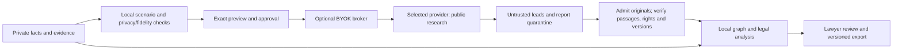

# Legal analysis and sanitized BYOK deep research

Requirement amendment: **5 October 2026**. This specification evaluates the user's
legal-analysis, self-correction and external deep-search goals and extends the
[canonical roadmap](ROADMAP.md). It specifies the target and qualification gates;
implementation progress is tracked separately from deployment and legal approval.
The three research attachments remain inputs to the [data strategy](DATA_KNOWLEDGE_STRATEGY.md).

The first R05A runtime slice now provides [lawyer-authored private analysis drafts](ANALYSIS_WORKBENCH.md),
source revision/hash binding, declared-structure checks, immutable revisions and
exact-version exports. Manual drafting uses no model. A separate
[local-model proposal slice](ANALYSIS_SUGGESTIONS.md) now provides up to two bounded
passes against fixed private inputs, declared-structure checks, job checkpoints and
human adoption. [Version-bound human review](ANALYSIS_REVIEWS.md) now records
criteria/findings, conditional private-draft decisions and source/review dependency
revalidation without changing original text or machine checks. Human change requests
withhold the conclusion; new versions require fresh review. [Opt-in review-informed
proposals](ANALYSIS_FEEDBACK.md) now bind selected findings to actual permitted edits,
manual-work requirements or unresolved outcomes, preserving review history and
accepted-pass provenance. They do not establish semantic repair. Full public/historical legal synthesis, semantic/adverse correction,
qualified Standard/Deep modes and every BYOK adapter remain pending; these goals
are not satisfied merely by a structurally complete draft or a repeated model call.

## 1. Assessment and product decision

The architecture is suitable, but the existing foundation is not yet the requested
legal analyst. Current research validates exact quotations; a fuller legal synthesis,
automated consistency loop and BYOK research adapters still need implementation and
qualification. More model time alone does not establish reliability.

| User goal | Existing foundation | Required addition / release evidence |
|---|---|---|
| Analyze documents and precedents to construct arguments | Local intake, fact/evidence ledger, two graphs, quotation validation and argument notes | A source-backed legal analysis artifact in the **first contract slice**, with applicable versions, adverse authority and uncertainty |
| Detail logical steps | Citations, scenarios, corrections and review history | Inspectable premises, rules, application, counterarguments and conclusions; evidence and assumption links at every consequential step |
| Maintain consistency through self-correction | Contradiction links and manual corrections | Bounded detect → retrieve → revise → verify workflow, measured against single-pass analysis |
| Spend more time on difficult research | Resource-bounded retrieval and local inference | Standard/Deep budgets, checkpoints, cancellation, cost visibility and paired quality/time evaluations |
| Choose OpenAI, Anthropic or Gemini using BYOK | No such adapter; the current gateway rejects arbitrary case narratives | Three separately qualified provider adapters behind one optional connected research broker |
| Send a realistic scenario without PII | Narrow public-query policy and exact-request approvals | Local privacy **and legal-fidelity** checks, exact preview, immutable approval, confidential transformation map and independently verified return path |

The new user instruction authorizes planning an exception for **sanitized external
research**, superseding the earlier blanket prohibition only for that lane. It does
not replace `llm-inference-engine-v1`, authorize private-document uploads, or turn the
approved laptop tunnel into general cloud access. No provider request or credential
change is performed by this planning revision.

Two installation modes remain explicit:

- **Disconnected:** local documents, inference, OCR, embeddings, both graphs and installed
  public sources; no external research calls. Full local analysis remains a product goal.
- **Connected research:** an optional, administrator-enabled BYOK lane for approved
  sanitized scenarios. The core remains on-premises; this mode uses external processing
  and must not be described as air-gapped. The laptop transport exception is separate.

## 2. The legal analysis work product

For each candidate issue, produce an editable, versioned argument record containing:

1. **Question and posture:** requested outcome, alternative legal classifications,
   relevant events, procedural stage and unresolved jurisdiction questions.
2. **Premises:** established facts, allegations, disputed evidence and explicit assumptions,
   each linked to authorized passages; missing information remains missing.
3. **Rule and authority:** exact provision/version, temporal and jurisdictional conditions,
   exceptions, burden/standard where established, and source-backed authority treatment.
4. **Application:** a concise explanation of how each supported fact relates to a rule
   element, why a cited decision is comparable or distinguishable, and what remains uncertain.
5. **Competing argument:** the strongest discovered adverse interpretation, material
   factual distinction and evidence that could change the assessment.
6. **Provisional conclusion and next step:** support, limits, evidence gaps and review priority.
   Distinguish a supported conclusion from a conditional scenario or insufficient evidence.

This is an evidence-backed rationale for lawyers, not a transcript of private model
chain-of-thought. Do not fabricate intermediate logic or treat a generated explanation
as evidence. A citation's existence, a graph path or repeated model agreement cannot
prove that a legal proposition follows. Calculations use reviewed deterministic rules
and parameters with explicit inputs; free-form model arithmetic is not the calculator.

Record claim dependencies on private facts, public passages, provision versions,
assertions, review decisions and policy/model snapshots. Updates mark affected work
Stale and propose revisions; they never overwrite a lawyer's reviewed product. Keep
Draft, Needs review, Reviewed and Stale states; an automated critic cannot confer Reviewed.

## 3. Bounded analysis and correction

The local orchestrator plans candidate issues, retrieves supporting and adverse material,
constructs an argument draft, checks it, obtains missing evidence where possible and
creates a revised draft. Use separate checker inputs and deterministic checks to reduce
self-confirmation; using the same model twice is not independent legal adjudication.

Mandatory checks cover exact citation support; source/decision role; applicable time and
institution; consistent party identities; allegations versus findings; missing elements,
exceptions and contrary authority; incompatible premises; negation; invalid numeric/date
operations; and conclusions stronger than their support. A logical conflict and a legitimate
disagreement between authorities remain different outcomes.

Each correction records the challenged claim, defect, evidence, changed conclusion and
remaining uncertainty. Re-run affected checks after revision. Stop when the task's checks
are satisfied, new evidence is exhausted, the bounded revision limit is reached or a
budget/cancellation intervenes. Unresolved critical defects withhold the affected conclusion
and identify the needed evidence or lawyer decision. Never extend the loop indefinitely
or increase confidence merely because the wording has stabilized.

| Mode | Intended behavior | Budget contract |
|---|---|---|
| Standard local analysis | Initial issue/evidence/argument pass plus mandatory validation | Finite retrieval, context, token and correction limits; useful partial work with gaps |
| Deep local analysis | More alternative issues, historical/adverse research and evidence-driven revisions | Larger explicit limits; progress checkpoints; local resource quota; no expanded tool permissions |
| BYOK deep search | Public authority discovery for a released sanitized scenario, followed by local verification/application | Provider-specific time, token, search/tool, response-size and spend ceilings within the approved envelope |

Exact presets are calibrated on declared hardware, model capabilities and R01 samples.
Always expose elapsed time, stage, sources checked, unresolved issues and any provider cost
estimate/actual usage. The roadmap's retrieval-only p95 target does not cover end-to-end
deep research. Record local compute time even when no external bill exists. More time is
offered as a research option; the measured quality/time tradeoff determines its defaults.

Queue and resume jobs with pinned input versions and authorization rechecks. Exhausted
budgets return explicit partial/incomplete results. Do not silently downgrade a failed
deep task into a completed answer. Cancellation stops new local dispatch and attempts remote
cancellation where supported; it cannot undo data already transmitted or guarantee refunded
charges. Reserve spend atomically for concurrent jobs; disclose any bounded in-flight cost
that a provider cannot hard-cap, and disable that mode if the firm's cap cannot be honored.

## 4. Local scenario abstraction and release

Build a typed scenario from the authorized fact ledger **locally**. Do not submit raw
questions, conversation history or documents to an external model for sanitization.

The outbound scenario contains only jurisdiction, candidate legal questions, neutral actor
roles, legally relevant relationships, minimal established/disputed facts, necessary chronology,
known unknowns, requested authority types and research scope. Keep source IDs, original-to-role
mapping, omission/generalization reasons and fidelity findings encrypted in the matter store.
Do not include customer/workspace IDs, file names, private quotes, annotations, case identifiers,
firm playbooks, access tokens or the matter's raw list of selected authorities.

Run independent privacy and fidelity gates:

- Detect Turkish names and inflections, TCKN/VKN, contact/address/IBAN details, party/court
  identifiers, secrets and confidential commercial information. Test OCR noise, encoded or
  spaced identifiers, URLs, tables, image-derived text and metadata, not just clean prose.
- Assess combinations of dates, amounts, locations, occupations, institutions and rare facts
  that could identify a person or matter. Pseudonyms alone do not establish anonymity.
  Evaluate cumulative disclosure across related requests; keep that history matter-confidential.
- Preserve actor distinctions, allegations, negation, obligations, event order, legal thresholds
  and applicable-law dates. Use role labels, relative chronology or ranges only when legal meaning
  survives. Do not round across a threshold or shift an event across an amendment date.
- If a legally necessary fact remains identifying, keep that question local or research a more
  general legal rule. Label any alternative hypothetical explicitly and keep it separate from
  the actual facts. “True-to-life” means faithful abstraction, not invented facts filling gaps.

For example, “a supplier alleges that a commercial buyer failed to pay after delivery; the
buyer disputes conformity; notice timing is uncertain” can preserve an issue structure.
It is only an illustrative template: the actual scenario must be derived from supplied
evidence. Exact amount/date questions that determine an outcome may need local resolution.

The lawyer previews the exact outbound text, removed/generalized detail and fidelity warnings,
selected provider/model, destination, enabled tools, retention/storage conditions, scope and
maximum budget. Bind approval to the complete canonical request envelope, its digest,
sanitizer/policy versions, current matter/user authorization, key permission, expiry and
single-use dispatch nonce. The credential is injected separately by the broker, never included
in the preview or prompt. A policy denial cannot be overridden by ordinary request approval.

Changed private facts, payload, provider/model, tools or expanded scope require a new release.
The application must not silently append context on a retry or follow-up. Recheck permissions
immediately before dispatch and result publication. A lawyer may edit and resubmit a safe
abstraction, but approval alone does not establish anonymization or lawful processing.

## 5. Connected broker, keys and remote tools

Create a separate BYOK broker with restricted provider egress and service authentication.
It accepts only approved envelopes, a scoped credential reference and a job capability;
it has no private document mount, arbitrary matter query, graph write or provider-admin route.
The existing public-source gateway keeps its credential-free source-fetching role. Adding
vendor domains to its allowlist does not implement BYOK safely.

Users provide an API key for **one selected provider per job**. Store it encrypted in a
server-side credential vault, user-owned by default. Explicit firm sharing requires its own
authorized-user policy; workspace membership alone does not grant use of someone else's key.
Support key validation, rotation, revocation and deletion. Separate authentication success,
model entitlement, search/tool availability, retention policy and billing readiness. The
existing root `.env` key remains for the local provider; it is not a multi-user BYOK store.
Never persist keys in browser storage, prompts, URLs, ordinary logs, exports or diagnostics.
No automatic provider switching, shared fallback key or cloud fallback from private analysis.

Use versioned provider adapters for capability discovery, submission, status/streaming,
cancellation where supported, normalized citations/usage and remote deletion where supported.
Record unsupported operations honestly. Pin an evaluated model/tool configuration; do not
assume a consumer subscription supplies API credits or identical research functionality.
Use synthetic material for initial adapter qualification; no real client facts in key tests.

Two tool contracts must remain distinct:

| Research method | Disclosure and control |
|---|---|
| Locally orchestrated search | Compile approved queries locally, fetch through permitted source adapters, and release only individually approved, rights-cleared public material to the external model. Remote search/private connectors are disabled. Every application-issued payload retains an approval binding |
| Provider-managed web research | The provider may generate further searches and contact its search services. The firm and lawyer approve this processing scope for the sanitized envelope; local approval cannot promise inspection of every downstream query or destination. Use only when the provider/tool terms and residual risk are accepted |

Provider-managed searches may use the released scenario and encountered public material,
never callbacks to private documents, local tools or secret stores. Disable private file
search, document uploads, arbitrary MCP, code execution and additional tools unless a future
separate reviewed contract is adopted. Explicit tool lists replace unsafe provider defaults.
If every downstream search must be preapproved, provider-managed mode is unavailable; use
the locally orchestrated method only where its search/data rights are separately qualified.

Transport controls bind registered HTTPS endpoint/path, DNS/TLS validation, headers/body,
model/tool allowlists and bounded responses; no redirects, arbitrary proxy inheritance or
user-supplied callbacks. Prefer outbound polling so no public callback endpoint is required.
Ambiguous submission outcomes enter reconciliation; never blindly retry a paid job when the
provider cannot establish whether it accepted the first request. Remote IDs and status tokens
remain confidential. Access/key revocation prevents further dispatch and local publication;
remote cancellation/deletion results are tracked without pretending already-sent data vanished.

## 6. Return path and local legal application

External output is a research lead, not legal authority. Inspect source URLs safely, acquire
permitted originals through the controlled source path and verify exact passages, identity,
date/version, jurisdiction, opinion role and relevant legal effect. Inaccessible, fabricated,
misquoted or out-of-coverage references stay unresolved and cannot support a final claim.
Research findings do not bypass source rights, legal review or immutable graph publication.

Keep provider report, independently admitted evidence and final legal work product distinct.
Apply verified authorities to the original private facts using local inference and tools.
Public graph search remains additive; external search cannot displace supporting/adverse
checks against the installed corpus. Remote instructions cannot change policy, ask for client
files, invoke local tools or approve assertions. Preserve required provider/source attribution
without suggesting that the provider is a legal authority.

Sanitized scenarios, report URLs, selections, remote IDs and research intent remain
matter-confidential. Encrypt retained artifacts, apply authorization to status/results/cache
reads, and scope caches by firm, user/matter permission, approval digest and snapshot. Keep
minimal operational audit metadata; exact release artifacts belong in restricted records,
not general prompt logs. Apply retention, legal holds and deletion to these new stores too.

## 7. Provider feasibility checks — 5 October 2026

These documentary checks inform adapter design. They do not prove account entitlement,
Turkish legal quality, lawful cross-border processing or equivalent feature availability.
Recheck API/model/tool terms before implementation qualification and on material changes.

| Provider | Verified documentation / implication for this plan |
|---|---|
| OpenAI | [Web search](https://developers.openai.com/api/docs/guides/tools-web-search) supplies API search tooling; qualify a supported Responses workflow. The [deep-research guide](https://developers.openai.com/api/docs/guides/deep-research) now marks its older model examples deprecated, so copying their IDs is not a valid integration plan. [Data controls](https://developers.openai.com/api/docs/guides/your-data) document feature-dependent state retention, including temporary background storage. Do not advertise universal zero retention or pin a legacy model from an example |
| Anthropic | The [web search tool](https://platform.claude.com/docs/en/agents-and-tools/tool-use/web-search-tool) supports repeated searches, citations and search limits. Implement bounded orchestration around the qualified API configuration, rather than assume a consumer Research endpoint. [API retention](https://platform.claude.com/docs/en/manage-claude/api-and-data-retention) depends on the organization, model and tools; dynamic filtering has different eligibility from basic search. A BYOK alone proves no retention arrangement |
| Gemini | The [Deep Research agent](https://ai.google.dev/gemini-api/docs/deep-research) is documented as preview through Interactions, with background execution requiring storage and no structured-output guarantee. Validate/normalize reports locally. The [data-retention page](https://ai.google.dev/gemini-api/docs/zdr) states Google Search grounding retains relevant content for 30 days and cannot disable that storage. Disable incompatible modes for firms whose policy requires otherwise; do not label this path zero-retention |

R01 records provider/account, region, processors/subprocessors, model/tools, processing purpose,
training terms, retention/deletion, search-result use/attribution, incident handling and any
required transfer mechanism with the firm's legal/security owner. No blanket conclusion about
lawfulness follows from public availability, masking, a paid account or request approval.

## 8. Delivery and measurable gates

R01 is in progress: [offline contracts and dossier checks](R01_QUALIFICATION.md) now cover
analysis/scenario structure, provider planning and evaluation/calibration. Actual legal/privacy
review, detectors, real samples and cost qualification remain pending. **R05A** delivers local reasoning/correction with the first
contract task; **R05B** delivers the optional BYOK lane after its privacy and provider gates.
R05B proceeds through common broker/sanitizer fixtures, then separate OpenAI, Anthropic and
Gemini adapter qualification. All three are planned choices; a disabled or unqualified adapter
is displayed honestly. R06 extends the local workflow to commercial/employment. R07 covers
job/cost/retention/recovery operations; R08 qualifies local and connected modes separately.

Add these gates to the unchanged held-out legal suite; define sufficient per-provider and
error-slice sample sizes before evaluating. Numbers below are release targets, not results.

| Area | Acceptance evidence |
|---|---|
| Argument quality | Every consequential application links premises and exact authority/version; zero critical unsupported inference, fact substitution, omitted exception or allegation/finding conflation in the release suite |
| Correction | Seeded contradictions, invalid applicability and unsupported deductions are repaired with evidence or explicitly withheld; compare with single pass and report introduced regressions, unresolved defects and lawyer review time |
| Depth | Paired Standard/Deep runs on frozen tasks/corpora report support, adverse recall, argument quality, elapsed time, compute/spend and total preparation time; claim improvement only where observed without critical correctness regression |
| Privacy | Zero seeded prohibited payload/credential disclosures in the release suite, including Turkish/OCR/encoding, rare combinations and cumulative request linkage; report contextual detection separately from direct-identifier recall |
| Fidelity and utility | Zero critical mutation of supplied facts, dates, thresholds, roles or uncertainty; lawyer-adjudicated issue/authority comparison before/after abstraction. Retain ≥98% legitimate sensitive-task passage via safe local completion where necessary; it is **not** an external-transmission quota |
| Authorization and spend | Cross-user key use, changed/replayed approvals, concurrent dispatch, revoked access, unsafe retry, hidden fallback and unauthorized tools fail closed; no duplicate uncontrolled billable submissions |
| Returned evidence | Fabricated citations, wrong passage/version, dissent as majority, summaries as judgments and prompt injection cannot become verified authority; unavailable originals stay explicit |
| Operations | Disconnected mode emits no external research traffic; queued/running revocation, timeout/cancellation, partial outputs, provider outage, retention/deletion and five-job contention are exercised |

Qualification reports distinguish software checks, privacy evaluation, legal adjudication,
provider API readiness and customer acceptance. Extend the executable evaluation schema and
tests in the relevant packets. The [offline extended scorer](EVALUATION.md) now checks
supplied judgments, frozen sample targets and paired measurements for these gates. It does
not perform the experiments, authenticate adjudication or qualify a provider; actual
legal/privacy evaluation and paired confidence intervals remain pending.
Neither self-correction nor a high observed support rate establishes a universal negligible-error
guarantee. Preserve the ≥30% median preparation-time benefit including verification/correction.

The 30–36-week envelope stays provisional. R01 must estimate the added application, security,
provider and legal-fidelity work and revise staffing/dates if necessary. Offline core qualification
can proceed independently, but does not establish completion of the three-provider BYOK goal.
