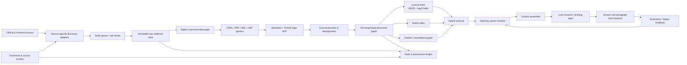
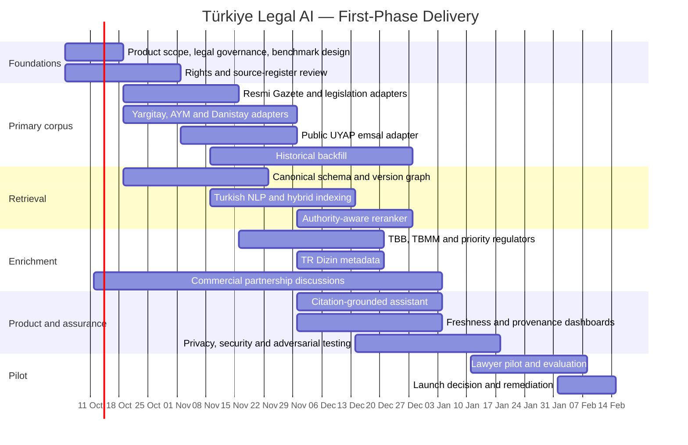

# AI Assistant for Lawyers in Türkiye — First-Phase Data, Retrieval and Governance Plan

## Executive summary

As of **3 October 2026**, the strongest first-phase strategy is to build the product as a **source-grounded Turkish legal research and drafting assistant**, not as a general-purpose chatbot and not initially as a UYAP case-management or filing agent. The authoritative corpus should be anchored in **Resmî Gazete**, the Presidency's consolidated **Mevzuat Bilgi Sistemi**, **Yargıtay**, **Anayasa Mahkemesi**, **Danıştay**, and the public **UYAP Emsal Karar Arama** service. UYAP itself exposes public precedent-search facilities separately from authenticated lawyer/citizen portals; those authenticated portals should be outside the first-phase ingestion boundary unless the Ministry provides a formal integration route and individual users explicitly authorise access. citeturn3search4turn21search2turn23view2turn23view3turn24view4turn24view5

The core architectural principle should be:

> **Publication authority first; consolidated text second; commentary last.**

Thus, a newly published Resmî Gazete amendment should become searchable before waiting for a commercial database or even a consolidated statute to update. The system should then reconcile that amendment against the authoritative consolidated text and maintain **versioned legislation**, allowing a lawyer to ask not only "what does Article X say?" but "what did Article X say on 12 May 2023?". Resmî Gazete's archive supports date, issue, legislation number/type, institution and other search dimensions and includes historical issues; this makes it the natural event stream for legislative change. citeturn3search4turn3search7

For case law, preserve each court's own identifiers and metadata. Yargıtay's public search currently reports roughly **10 million decisions**, while Danıştay's public service reports **418,260 documents** and supports searches by chamber, case/decision number, date and cited legislation. UYAP's public precedent service additionally exposes regional appellate and other court material. The product therefore needs an architecture designed for **tens of millions of legal documents**, not a small RAG demonstration. citeturn0search2turn23view1turn23view3turn24view6

The recommended first-phase product boundary is:

**In scope:** Turkish legislation and amendments; high-court and selected lower-court precedent; important regulatory decisions; lawyer-profession rules; parliamentary history; metadata from doctrine; legal research, source comparison, case/statute retrieval, summarisation and draft-generation with paragraph-level citations.

**Out of scope initially:** automated filing; scraping the authenticated UYAP Avukat/Vatandaş portals; autonomous legal conclusions without source evidence; bulk ingestion of subscription databases without contractual text-and-data rights; unrestricted uploading/training on client files; and unlicensed reproduction of books, journals or commercial editorial annotations.

A realistic first production pilot is an **approximately 18-week programme with 7–9 FTE**, organised around six source adapters, immutable provenance, version-aware retrieval and a lawyer-curated evaluation set. Commercial databases such as **LEXPERA, Kazancı and Legalbank** should be pursued in parallel as licensing/partnership opportunities, but the first release should not depend upon successful commercial negotiations. LEXPERA advertises legislation, case law, literature, templates, cross-linking and daily updates; Legalbank offers court decisions, legislation, literature, petitions/documents and reasons behind legislation through an authenticated subscription product. These are valuable enrichments, not substitutes for primary authority. citeturn24view0turn24view1turn24view2turn24view3

The most important non-functional requirement is **trust**: every legal proposition produced by the assistant should carry a resolvable source, document identifier, version/effective date and quoted or highlighted supporting passage. Where sources conflict or freshness cannot be confirmed, the answer should say so rather than silently choosing one.

## Source inventory and acquisition strategy

The labels below mean:

- **Mandatory:** required before a credible general Turkish-law pilot can launch.
- **Beneficial:** high-value first-phase or immediately subsequent source; mandatory when the corresponding practice area is supported.
- **Optional:** enrichment whose absence should not prevent the public-primary-source product from operating.

“Update frequency” below means observed or source-driven publishing behaviour, rather than an SLA promised by the publisher. Where the publisher does not document an API, rate limit, bulk licence or fixed publication interval, that fact is explicitly marked **unspecified**.

### Core and primary-source inventory

| Priority | Source | Authority and scope | Publishing/update pattern | Access method | Rights / licensing position | Reliability and first-phase treatment |
|---|---|---|---|---|---|---|
| **Mandatory** | **Resmî Gazete** | Official publication record: statutes, Presidential decrees/decisions, regulations, communiqués, appointments, selected court/administrative decisions and other official material. | Issue-driven; regular and mükerrer issues. Archive supports date, issue, legislation number/type and institution searches. citeturn3search4turn3search7 | Official web archive; HTML documents and linked documents/PDFs. **No documented public bulk/API located in this research.** | FSEK No. 5846 governs Turkish copyright; counsel should specifically assess the treatment of legislation/jurisprudence and separately assess site/database presentation and terms. citeturn25search3turn25search18 | **Highest authority for publication events.** Treat as legislative change event stream and retain original issue artefact permanently. |
| **Mandatory** | **T.C. Cumhurbaşkanlığı Mevzuat Bilgi Sistemi** | Consolidated Turkish legislation: statutes and major secondary legislation; TBB itself directs users to this system for legislation. citeturn23view9 | Source-driven; exact fixed update interval **unspecified**. | Web search/document UI; document downloads where exposed. Public API/bulk endpoint **not established in this research**. | Public official content does not by itself settle all reuse/database questions; confirm site terms and FSEK analysis before redistribution. | **Authoritative consolidation reference**, but retain RG amendment chain independently to detect lag/errors and enable historical versions. |
| **Mandatory** | **Yargıtay Karar Arama** | Court of Cassation decisions, including General Assemblies and chambers; the public service reports roughly 10 million searchable decisions. citeturn21search2turn0search2 | Publication-driven; fixed delay/cadence **unspecified**. | Public search UI plus document retrieval URLs observable from search results; no documented public bulk API identified. | Reuse position should be reviewed under FSEK and site terms; no general bulk licence identified. | **Highest-priority civil/criminal precedent source.** Ingest metadata and full official decision text where legally permitted. |
| **Mandatory** | **Anayasa Mahkemesi Kararlar Bilgi Bankası** | Constitutional review, individual applications and other AYM decision categories. The database exposes categories including individual application and norm review. citeturn1search0turn23view2 | Publication-driven; exact fixed cadence **unspecified**. | JavaScript web application and individual decision pages; public API **not documented in sources reviewed**. | Official-source rights analysis required; do not infer unrestricted bulk rights merely from public access. | **Highest authority for constitutional questions.** Preserve application number, decision type, section/plenary and outcome. |
| **Mandatory** | **Danıştay Karar Arama** | Council of State administrative/tax case law. Search supports chamber, case number, decision number, date and legislation number/name/article; current service reports 418,260 documents. citeturn23view3turn24view6 | Publication-driven; fixed cadence **unspecified**. | Public web search. Public bulk/API access **not documented**. | Same source-specific FSEK/terms review. | **Core administrative/tax authority.** Excellent structured citation signal because the UI already models related legislation. |
| **Mandatory** | **UYAP Emsal Karar Arama — public service only** | Public precedent search, including regional appellate and other judicial units; supports case/decision numbers, date and sorting. citeturn23view1 | Publication-driven; exact coverage delay and completeness **unspecified**. | Public web UI. UYAP separately links public precedent search and authenticated Avukat/Vatandaş/Kurum portals. citeturn24view4turn24view5 | UYAP site states all rights reserved. Bulk/API licence **unspecified**. citeturn24view5 | Use the **public emsal corpus** only in phase one. Do not automate authenticated Avukat/Vatandaş Portal access without formal integration and user authorisation. |
| **Mandatory** | **Türkiye Barolar Birliği — legislation, professional rules, tariffs, disciplinary decisions** | Avukatlık Kanunu, Meslek Kuralları, regulations, tariffs, directives and TBB Disciplinary Board decisions; TBB exposes these categories directly. citeturn23view9turn21search10 | Event-driven; disciplinary decisions grouped by year. | Public HTML/search plus publications; API **unspecified**. | TBB publishes books/journals digitally, but availability should not be interpreted as a blanket right to copy into an AI corpus. citeturn23view9 | **Mandatory because the product is specifically for lawyers.** Classify professional guidance separately from statutes/court authority. |

### Beneficial official and sector sources

| Priority | Source | Scope and authority | Access/update notes | Recommended phase-one treatment |
|---|---|---|---|---|
| **Beneficial** | **TBMM** | Bills/proposals, committee material, parliamentary minutes and legislative history; TBMM provides proposals, committees and historical minutes. citeturn9search12turn9search20 | Official web UI/documents; event-driven; API/bulk availability **unspecified**. | Ingest bill metadata, adopted-law lineage, committee reports and minutes relevant to enacted laws. Use as legislative history, **not as substitute for enacted RG text**. |
| **Beneficial** | **Uyuşmazlık Mahkemesi** | Jurisdictional-conflict decisions; official searchable decision database. citeturn21search5 | Public search; cadence/API limits **unspecified**. | Full metadata and decision text; modest corpus, high legal value. |
| **Beneficial** | **Sayıştay** | General Assembly, Appeals Board and Chamber decisions; public-finance/audit law plus secondary legislation and guides. citeturn21search32 | Official web pages/documents. | Mandatory if public procurement/public finance is a target practice area. |
| **Beneficial** | **KVKK / Kişisel Verileri Koruma Kurulu** | KVKK legislation, Board decisions, guidance, international-transfer materials and privacy practice. The authority maintains Board-decision and guidance collections. citeturn10search1turn10search23turn16search13 | Public HTML/documents; event-driven. API **unspecified**. | High priority across virtually all business-law practices and **mandatory for the assistant's own compliance corpus**. |
| **Beneficial** | **Rekabet Kurumu** | Competition Board decisions. Official decision-search service exists. citeturn21search23 | Public search; documented bulk/API **unspecified**. | Mandatory for competition/M&A practices. |
| **Beneficial** | **SPK** | Capital-markets legislation, Board bulletins, decisions/administrative sanctions and market guidance. Current official site exposes legislation, annual bulletin archives and a separate administrative-sanctions service. citeturn24view9 | Web applications/downloads; event-driven. API **unspecified**. | Mandatory for capital-markets/securities practice; poll bulletins and legislation frequently. |
| **Beneficial** | **BDDK** | Banking regulation, published and unpublished Board decisions, regulatory drafts and repealed rules; these categories are exposed by the official site. citeturn22search7turn22search9 | Official HTML/documents; API **unspecified**. | Mandatory for banking/financial-regulation practice. |
| **Beneficial** | **EPDK** | Energy-market legislation, licences, tariffs and regulatory material. Official site exposes a legislation section. citeturn20search7 | Web/documents; API/cadence **unspecified**. | Practice-area adapter rather than core general-law blocker. |
| **Beneficial** | **Kamu İhale Kurumu / EKAP** | Public-procurement information and tender ecosystem. EKAP is the official electronic public-procurement platform. citeturn21search3 | Public plus authenticated functionality. Exact machine-readable decision feed **unspecified**. | Separate publicly reusable material from authenticated tender workflows. |
| **Beneficial** | **TÜRKPATENT** | IP bulletins and official IP-related publications; 2026 bulletins are published/downloadable through the official site. citeturn4search22 | Downloadable bulletins/web pages. | Mandatory for IP practice. |
| **Beneficial** | **Ticaret Bakanlığı / Reklam Kurulu** | Consumer and advertising regulatory decisions/bulletins; official archive contains dated Board meeting bulletins. citeturn21search24 | HTML/PDF, meeting-driven. | High-value consumer/e-commerce source. |
| **Beneficial** | **Kamu Denetçiliği Kurumu** | Ombudsman recommendations and other decisions; searchable database contains 2026 decisions. citeturn21search9 | Public decision database. | Useful administrative-law persuasive material; mark authority accordingly. |
| **Beneficial** | **Relevant ministries and agencies** | Circulars, instructions, guidelines, secondary legislation and administrative practice. Ministry sites commonly organise legislation into laws, regulations, directives, circulars and guidance. citeturn5search21turn5search25turn15search11 | HTML/PDF, usually decentralised. API typically **unspecified**. | Add via practice-area “source packs”: Justice, Treasury/Finance, Labour, Trade, Health, Interior, Industry, Transport, tax/revenue etc. |

Regulatory sources should **not all be collected indiscriminately on day one**. Define target practice areas and promote the relevant regulator from beneficial to mandatory. This avoids spending engineering capacity crawling dozens of low-use agencies while core case law remains incomplete.

### Doctrine, bars and commercial enrichment

| Priority | Source | Scope | Access / update | Rights and recommended use |
|---|---|---|---|---|
| **Beneficial** | **TR Dizin** | National academic-journal metadata across social sciences and other disciplines; legal articles are an important subset. TR Dizin explicitly documents an API for article data. citeturn23view4turn23view5 | **Documented API** for article data; authentication/rate-limit details should be taken from the current API documentation during integration. | Prefer metadata/abstract/citation indexing. TR Dizin states full-text access depends on participation-permission agreements with journal editors, so do **not** assume API metadata rights imply general full-text training/republication rights. citeturn23view5 |
| **Beneficial** | **DergiPark + individual law journals** | Turkish scholarly articles, including major university law journals. | Public journal/article pages. **A general DergiPark OAI-PMH endpoint was not confirmed in this research and should therefore be treated as unspecified.** | Use TR Dizin API where possible; otherwise ingest bibliographic metadata/links and only ingest full text when an explicit open licence or publisher permission supports it. |
| **Beneficial** | **TBB journals/books and major bar-association publications** | Doctrine, professional guidance, reports, practice notes. TBB provides digital publications and links to bar e-publications. citeturn23view9 | Public web/e-publication; usually event-driven. | Index metadata and links by default; full text subject to publication-specific licence/permission. |
| **Beneficial** | **İstanbul, Ankara, İzmir and pilot-region bar associations** | Local professional notices, practice guidance, commission material, training notes. | Web/PDF; event-driven; interfaces differ. | Add bars relevant to pilot lawyers rather than crawling every bar immediately. Keep their materials below primary legal authorities in ranking. |
| **Beneficial — licence required** | **LEXPERA** | Legislation, millions of precedents, literature, commentary, templates and cross-links; provider states legislation is updated daily. citeturn24view0turn24view1 | Paid/subscription database. Public developer/bulk licence **not established** here. | Pursue **contracted API/feed/data licence**. Do not scrape authenticated content. Particularly valuable for editorial links, doctrine and coverage gap analysis. |
| **Beneficial — licence required** | **Kazancı** | Commercial precedent and legislation database; long-established Turkish legal information service. citeturn4search1 | Paid database/web UI; public API/bulk licence **unspecified**. | Partnership enquiry. No dependency in MVP until written machine-use rights exist. |
| **Beneficial — licence required** | **Legalbank** | Court decisions, legislation, petitions/documents, literature and legislative reasons; full access requires login/subscription. citeturn24view2 | Paid authenticated service; update index is exposed. | Partnership/feed only. Site expressly states “all rights reserved”. citeturn24view3 |
| **Optional / specialist** | **Mevzuat.Net** | Subscription service focused particularly on foreign-trade/customs and practical regulatory information; current pages track Resmî Gazete issues and trade changes. citeturn20search10 | Subscription web service. | Valuable for customs/trade practice, but distinguish it clearly from the **official** Mevzuat Bilgi Sistemi. Negotiate licence before ingestion. |
| **Optional** | **Other university journals, monographs, books, practitioner newsletters** | Doctrine and commentary. | Publisher sites, subscriptions, library databases. | Metadata/link-first; full text only under appropriate open licence, author/publisher permission or negotiated TDM/product licence. |

**International material** such as ECtHR/HUDOC, EU law and treaty databases should become beneficial where the chosen practice areas require them, but they should be maintained as a distinct authority layer rather than mixed indiscriminately with domestic Turkish materials.

### Concrete fetching design

No adapter should assume that “accessible in a browser” means “safe for high-volume automated retrieval”. Where no official rate-limit documentation was found, the table below gives **proposed conservative engineering defaults**, not publisher-imposed limits.

| Source class | Preferred retrieval mechanism | Example discovery/selectors | Authentication / throttling | Delta strategy |
|---|---|---|---|---|
| **Resmî Gazete** | HTTP fetch archive/issue pages → individual HTML → linked file/PDF; request an official feed/bulk interface in parallel. | Match archive/issue anchors semantically, e.g. `a[href*="/eskiler/"]`; parse issue date/number and document headings rather than fragile CSS classes. | Public; documented limit **unspecified**. Start at **≤1 req/s/host**, concurrency 1–2, exponential back-off. | Poll issue index every 5–15 min around the clock; new issue/date/number ⇒ ingest. Re-hash recent 7 days to catch replacements. Monthly historical reconciliation. |
| **Mevzuat Bilgi Sistemi** | Normal HTTP/browser adapter for search/document pages; request official bulk/version feed. | Anchor by document number/title and semantic field labels rather than generated classes. | Public UI; API/rate limits **unspecified**. | Daily canonical-document diff; compare content hash and amendment metadata against RG events. Weekly reconciliation of active corpus. |
| **Yargıtay** | Search by narrow decision-date windows → result pagination → official document endpoint/page. | Result document links observable through Yargıtay's retrieval pattern; use stable link attributes/IDs rather than visual CSS. | Public search; rate limit **unspecified**. Default 0.5–1 req/s; resume checkpoints. | Incremental by decision/publication window; overlap previous 7–30 days to detect delayed additions. Full identifier reconciliation quarterly, not daily. |
| **AYM** | Prefer stable individual decision pages/API if an official machine interface emerges; otherwise browser-assisted discovery plus HTTP retrieval of final documents. | `a[href*="/kbb/"]`-style URL matching; identify category/application number/date from semantic fields. | Public JS app; machine API **unspecified**. | Poll latest decision lists every 1–2 h; overlapping 30-day rescan because publication can lag decision date. |
| **Danıştay** | Public detailed search with date ranges; paginate results. | Parse labelled `Daire`, `Esas Numarası`, `Karar Numarası`, `Tarih`, `Mevzuat Numarası/Adı/Madde`, all currently present in official search. citeturn24view6 | Public; rate limit **unspecified**; conservative self-throttle. | Incremental date-window searches with overlap; hash metadata/text. Quarterly broad reconciliation. |
| **UYAP Emsal** | Public emsal search only. | Semantic fields include keyword, unit, case/decision number and date. citeturn23view1 | Public interface. **Do not reuse credentials or automate Avukat/Vatandaş Portal in phase one.** | Date-window crawl with overlap and checkpointing; compare case/decision identifiers and hashes. |
| **Regulators/ministries** | RSS when actually offered; otherwise listing-page crawler + HTML/PDF downloader. | Scope adapter to `/kararlar`, `/mevzuat`, `/duyurular`, `/bulten` equivalents and validate titles/dates. | Usually public; limits mostly **unspecified**. | Listing-page hash every 30 min–24 h depending legal impact; only download changed/new artefacts. |
| **TR Dizin** | **Official API first.** citeturn23view4 | API identifiers rather than scraping. | Follow current API's documented authentication/quotas; those details are **unspecified here**. | `updated_since`/date pagination if supported; otherwise watermark on record IDs/dates plus weekly reconciliation. |
| **Journal repositories** | Publisher API/OAI-PMH **only where explicitly exposed**; otherwise metadata page harvesting or partnership. | DOI, ISSN, canonical article URL, `<meta>`/schema metadata. | Repository-specific. | Weekly incremental metadata harvest. |
| **Commercial databases** | Contracted API, SFTP dump, webhook/feed or licensed bulk snapshot. | **No authenticated HTML selectors.** | Contractual credentials and quotas. | Prefer provider delta feed; nightly reconciliation; store vendor provenance separately from official canonical records. |

For all unsupported web interfaces, a source adapter should have three layers: `discover()` → `fetch()` → `parse()`. This isolates a changed website from the remainder of the ingestion stack. A DOM contract test should run every day using several known documents; if selectors or result counts fail unexpectedly, **stop ingestion for that source rather than silently ingesting malformed data**.

## Freshness, versioning and legal-validity policy

A legal assistant needs two separate clocks:

1. **Source freshness:** how quickly a newly published item is detected and indexed.
2. **Legal validity:** when that rule actually enters into force, is amended, suspended or repealed.

A document published today may enter into force later; conversely, consolidated legislation may be updated only after an RG change. Consequently `published_at`, `effective_from`, `effective_to`, `detected_at` and `fetched_at` must never be collapsed into one timestamp.

### Proposed freshness SLAs

The following are **product SLAs measured from availability at the monitored public source**, not promises about how quickly courts or agencies publish their own decisions.

| Material | Polling / discovery cadence | Target searchable SLA | Staleness warning | Hard escalation | Priority logic |
|---|---:|---:|---:|---:|---|
| **New Resmî Gazete issue / amendment** | 5–15 min | **≤30 min** after detection | 60 min | 4 h | Highest. Legislative publication can immediately change answers across many practices. |
| **Consolidated legislation** | Event-triggered by RG + daily reconciliation | RG amendment immediately; official consolidation **≤24 h after detected change** | 24 h | 48 h | Never block RG amendment on consolidation; show “consolidation pending” when necessary. |
| **AYM / Yargıtay / Danıştay** | 1–4 h | **≤6 h** after source publication | 24 h | 48 h | Prioritise high court, plenary/general assembly, cited statutes and recent/high-demand practice areas. |
| **UYAP public emsal / other courts** | 4–12 h | **≤24 h** | 48 h | 72 h | Lower freshness priority than core high courts unless a pilot practice depends heavily on first-instance/BAM precedent. |
| **High-impact regulator decisions** — KVKK, Rekabet, SPK, BDDK etc. | 30 min–4 h by source | **≤4 h** | 12 h | 24 h | Raise priority where a source can change compliance obligations, sanctions or market conduct. |
| **General ministry circular/guidance** | 4–24 h | **≤24 h** | 48 h | 72 h | Legal-effect classification matters more than raw recency. |
| **TBB/bar professional guidance and disciplinary material** | 6–24 h | **≤24 h** for rules/decisions; 72 h for general guidance | 72 h | 7 d | TBB professional rules > local-bar commentary in ranking. |
| **Doctrine / academic metadata** | Daily–weekly | **≤7 d** | 14 d | 30 d | Lower latency is rarely worth heavy crawling costs. |
| **Licensed commercial feed** | Contract-dependent | Feed SLA + 1 h internal | 2× feed SLA | Contract-specific | Enrichment only; official primary source still controls attribution. |

The **staleness calculation should use expected source behaviour**, not simply “age of newest document”. For example, a court with no new public decision for a day may be completely healthy, while a Resmî Gazete adapter that misses an issue is critical. Maintain for each source:

`last_successful_poll`, `last_change_detected`, `last_document_published`, `expected_publish_pattern`, `failure_count`, `coverage_watermark`, and `freshness_confidence`.

### Prioritisation heuristic

For ingestion queueing, a useful scoring function is:

```text
priority =
    legal_effect_weight
  × authority_weight
  × freshness_urgency
  × practice_area_demand
  × expected_user_impact
  × source_change_probability
```

A new RG amendment therefore outranks a newly indexed law-review article. An AYM norm-review decision outranks a generic ministry blog post. A new SPK or BDDK measure may outrank unrelated case law for a capital-markets pilot.

For retrieval, recency alone should **never** determine legal relevance. The ranking layer should consider:

`authority × temporal_validity × exact_citation_match × court/decision_type × issue_match × textual_relevance × semantic_relevance × citation_graph × source_completeness`.

The assistant should explicitly answer temporal questions against a **time slice**. A query such as “What was the limitation period on 1 June 2022?” must retrieve versions effective on that date rather than today's consolidated text.

### Efficiency trade-offs

A full re-index is justified when parser logic, Turkish tokenisation, chunking or a major metadata field changes. It is **not** justified every time a source adds documents. Normal operations should be append/update-by-version:

```text
new source document
        ↓
raw hash already known? ── yes ──> no-op
        │ no
        ↓
parse + normalise
        ↓
canonical record exists?
   │ no                │ yes
create                 compare normalised hash
                       │
                changed? ── no → provenance refresh only
                   │ yes
                   ↓
            create new version
            + incremental index
```

For very large sources such as Yargıtay, historical recrawls should use rolling reconciliation partitions—e.g. year/chamber buckets—rather than repeatedly downloading the entire corpus. The size of Yargıtay's current search corpus makes this particularly important. citeturn0search2

## Ingestion, Turkish NLP and legal retrieval architecture

The design should separate **raw evidence**, **canonical legal documents** and **retrieval representations**. This prevents a parser bug, model upgrade or later licensing change from destroying the source of truth.



### Canonical metadata schema

Use a common envelope plus document-type extensions. A practical first schema is:

| Field family | Recommended fields |
|---|---|
| **Identity** | `canonical_id`, `version_id`, `source_record_id`, `source_name`, `source_authority_level`, `document_type`, `jurisdiction=TR`, `language=tr` |
| **Source provenance** | `canonical_source_url`, `discovery_url`, `fetched_at`, `detected_at`, `http_etag`, `http_last_modified`, `raw_sha256`, `normalised_sha256`, `parser_version`, `ingestion_run_id` |
| **Temporal** | `published_at`, `decision_date`, `effective_from`, `effective_to`, `repealed_at`, `validity_status`, `validity_confidence` |
| **Legislation** | `legislation_number`, `title`, `rg_date`, `rg_number`, `document_kind`, `article`, `paragraph`, `subparagraph`, `amends[]`, `amended_by[]`, `repeals[]`, `legal_basis[]` |
| **Case law** | `court`, `chamber`, `case_number_esas`, `decision_number_karar`, `application_number`, `decision_type`, `panel`, `outcome`, `cited_legislation[]`, `cited_cases[]` |
| **Administrative** | `agency`, `board`, `decision_number`, `meeting_number`, `sanction_type`, `legal_basis[]`, `sector` |
| **Doctrine** | `authors[]`, `journal`, `volume`, `issue`, `pages`, `ISSN`, `DOI`, `abstract`, `keywords[]`, `publisher` |
| **Rights/privacy** | `rights_status`, `licence_id`, `licence_scope`, `redistribution_allowed`, `training_allowed`, `retention_policy`, `personal_data_class`, `special_category_flag`, `redaction_status` |
| **Quality** | `parse_quality`, `ocr_used`, `language_confidence`, `completeness_score`, `metadata_validation_status`, `human_review_status` |
| **Retrieval** | `practice_areas[]`, `legal_entities[]`, `citations[]`, `chunk_ids[]`, `embedding_model_version`, `lexical_index_version` |

Do **not** use a URL as the canonical ID. URLs change. Legal identifiers should dominate canonicalisation:

- statute: `TR:LAW:6098`, for example;
- provision-version: statute + article + validity interval;
- Yargıtay/Danıştay: court + chamber + `E.` + `K.` identifiers;
- AYM individual application: application number + decision date;
- regulatory decision: agency + formal decision number/date.

### Deduplication and canonicalisation

Use three levels:

**Exact:** SHA-256 of raw bytes and separately of normalised text.

**Structural:** legal identifier + decision date + issuing body.

**Near duplicate:** MinHash/SimHash or high-similarity text comparison for the same judgment appearing in UYAP, a high-court site and a commercial database.

Do not discard alternative copies. Link them:

```text
Canonical decision
 ├── official Yargıtay representation   [primary]
 ├── UYAP representation                [official secondary representation]
 └── licensed commercial representation [editorial enrichment]
```

When texts differ, preserve each source version and raise a discrepancy rather than merging silently.

For legislation, construct an explicit amendment graph:

```text
Act version V1
   └── amended by RG document A
          ↓
Act version V2
   └── amended by RG document B
          ↓
Act version V3
```

This enables `valid_on(date)` retrieval and amendment comparison.

### Turkish-specific language processing

Turkish needs deliberate treatment because naive English-oriented normalisation damages legal search.

The pipeline should:

- perform **Unicode NFC normalisation** while preserving Turkish characters;
- use Turkish-aware casing: `I/ı` and `İ/i` must not be processed by locale-insensitive lowercasing;
- index both exact surface forms and morphological/lemmatised representations;
- avoid destructive stemming of proper nouns, statute titles and case identifiers;
- recognise legal abbreviations such as `TCK`, `CMK`, `HMK`, `TBK`, `İİK`, `AYM`, `HGK`;
- recognise patterns such as `E. 2024/123`, `K. 2025/456`, `2023/12345 başvuru`, `m. 5/1-a`, `Geçici Madde 3`;
- normalise date variants such as `03.10.2026`, `3 Ekim 2026` and machine ISO dates;
- extract law number + article references as structured entities, not ordinary tokens;
- keep legal quotations linked to exact source offsets;
- develop NER for courts, chambers, public bodies, legislation, legal concepts and decision identifiers;
- distinguish Turkish morphology-expanded retrieval from exact phrase search;
- retain OCR confidence and page/paragraph coordinates for older scans.

Chunking must be **legal-structure-aware** rather than every N tokens. A statute chunk should normally be an article/subarticle; a judgment chunk should follow sections such as facts, relevant law, assessment and operative part where the source exposes such structure. Long chunks can have child passages but should retain a link to their parent decision.

### Retrieval and ranking

Use a three-channel candidate generator:

```text
lexical BM25
     +
semantic vector retrieval
     +
structured legal/citation lookup
     ↓
authority- and validity-aware reranker
```

The highest-value ranking features should be:

| Signal | Why it matters |
|---|---|
| **Exact statute/article or E./K. match** | A user citing `6098 m. 138` normally wants that provision, not a semantically similar article. |
| **Temporal validity** | Superseded law must not outrank the version applicable to the requested date. |
| **Source authority** | RG/official court decision should outrank commentary for propositions of positive law. |
| **Court and decision type** | Allows reasoned hierarchy/configuration without pretending Turkish law has common-law stare decisis. |
| **Practice-area fit** | Reduces irrelevant cross-domain semantic matches. |
| **BM25 phrase score** | Strong for Turkish legal terminology and quoted passages. |
| **Semantic score** | Finds conceptually relevant decisions with different wording. |
| **Citation graph** | Decisions repeatedly citing the same provision/cases are often more useful. |
| **Decision/document recency** | Useful after authority and temporal validity, not before them. |
| **Completeness/parse quality** | Full reasoned text should outrank a broken/OCR-fragment record. |
| **Source corroboration** | Identical official identifiers across multiple sources increase confidence but do not create extra legal authority. |

The answer generator should be supplied with both **supporting passages and legal metadata**. It should not be allowed to fabricate a citation from model memory. At minimum, every substantive answer should distinguish:

**Primary authority → relevant decisions → regulatory/professional material → doctrine/commentary.**

## Provenance, monitoring and legal/ethical compliance

### Provenance should be first-class data

Every fetched artefact should receive an immutable evidence record:

```json
{
  "source": "YARGITAY",
  "source_record_id": "...",
  "canonical_url": "...",
  "detected_at": "...",
  "fetched_at": "...",
  "http_status": 200,
  "raw_sha256": "...",
  "normalised_sha256": "...",
  "parser_version": "...",
  "rights_status": "...",
  "canonical_document_id": "...",
  "document_version_id": "..."
}
```

Retain raw HTML/PDF/XML/UDF bytes in immutable object storage, ideally with object versioning and retention controls. A later parser should create a new parsed representation rather than modifying the evidence object.

For a user-visible citation, retain:

`canonical_document_id → version_id → chunk_id → character/page offsets → source URL`.

This supports a “show source” action where the lawyer can inspect the exact official passage rather than merely seeing a bibliography.

### Monitoring and validation

Operate four independent monitor layers.

**Acquisition monitoring:** HTTP failures, response latency, robots/terms changes, captcha/anti-automation signals, pagination anomalies, sudden result-count changes and adapter DOM contract tests.

**Freshness monitoring:** source watermarks and the SLAs above. Dashboards should measure `p50/p95 detection lag`, `p50/p95 searchable lag`, `% sources within SLO`, and unresolved source outages.

**Semantic/data validation:** reject impossible values such as future decision dates where not legitimate, malformed E./K. numbers, empty decisions, statute records lacking identity, duplicate RG issue numbers or sudden massive text shrinkage.

**Cross-source validation:** compare RG amendment events with the consolidated legislation system; compare a sampled set of high-court decisions with UYAP; compare regulatory decisions against RG when both carry the same instrument. Differences become review tickets, not automatic overwrites.

A lawyer/data-editor queue should sample new sources and all high-impact anomalies. The system should keep “unverified”, “machine-validated” and “human-validated” statuses separate.

### Copyright and database rights

The Turkish **Fikir ve Sanat Eserleri Kanunu No. 5846** is the starting point for copyright analysis; the law is published by the Ministry of Culture and Tourism and is also available through WIPO Lex. citeturn25search3turn25search18

Before production ingestion, Turkish IP counsel should produce a source-by-source rights matrix covering:

`retrieval → caching → full-text indexing → embeddings → model-context use → model training/fine-tuning → quotation → redistribution to users`.

The fact that official material is publicly visible is **not itself a sufficient engineering rule** for every one of those acts. Counsel should specifically analyse FSEK provisions concerning legislation and jurisprudence, as well as contractual website terms, database/editorial layers and third-party material embedded in official sites. Commercial value-added content must not be treated as equivalent to the underlying public judgment.

Particular policies should be:

- **Primary government/court text:** ingest only after the legal basis and source terms are documented; preserve attribution and the original official link.
- **Commercial databases:** no credentialed scraping. Obtain a written licence expressly covering machine ingestion, indexing, embeddings/RAG use, persistence, user display and termination/deletion obligations.
- **Academic material:** metadata/abstract indexing by default; full text only where item/publisher licence permits it. TR Dizin explicitly says availability of article full text can depend on agreements with journal editors. citeturn23view5
- **Bar publications/books:** public viewing does not automatically mean corpus-reuse rights; licence or permission should be recorded per collection. TBB maintains extensive digital publication collections. citeturn23view9
- **Commercial editorial annotations:** treat headnotes, classifications, cross-links and commentary as separately protected/licensed even where the underlying judgment itself is ingestible.

A `rights_registry` should be machine-enforced. If a vendor contract permits search but not generative-context display, the retrieval layer must enforce that distinction.

### KVKK and lawyer confidentiality

This product deserves a stricter privacy posture than a normal information-retrieval product because judgments, client prompts and case files can contain personal data, special-category data and confidential legal information.

The KVKK Authority's current **Guide on the Protection of Personal Data in Lawyers' Professional Activities** expressly covers legal bases, processing conditions, domestic and international transfers, data-controller obligations, data security and the use of **generative AI tools** by lawyers. That should be a mandatory compliance input to product design. citeturn16search7

Moreover, the KVKK Board stated in a July 2026 principle decision concerning public legal entities that publishing documents containing personal data on the internet constitutes personal-data processing by making those data accessible. This is an important warning for legal-AI ingestion: **“already public” does not mean “outside privacy law”.** citeturn19search15

Accordingly:

- perform a **KVKK data-processing inventory** before launch;
- minimise personal data copied from judgments where identifiers are unnecessary;
- retain source redactions exactly and never attempt to reverse them;
- classify special-category data separately; the KVKK Authority maintains updated guidance for such data. citeturn19search11
- separate public legal corpus data from private user/workspace data at storage, access-control and model-context levels;
- encrypt in transit and at rest;
- provide tenant isolation and role-based access control;
- maintain immutable security/audit logs but avoid placing unnecessary matter contents in logs;
- define strict retention/deletion policies for user prompts and uploaded files;
- do not use lawyer/client matter content for general model training by default;
- subject international hosting/model-provider transfers to a specific KVKK transfer analysis;
- implement breach response, access-request, deletion/anonymisation and processor/subprocessor governance.

The KVKK framework includes general processing obligations, data-controller obligations and data-security requirements, and the Authority publishes specific compliance guides. citeturn19search3turn19search7turn19search19

**GDPR** should be implemented as a second compliance layer where its territorial scope is triggered—for example by relevant EU/EEA establishment, offering/monitoring circumstances or EU-regulated processing. The official text is Regulation (EU) 2016/679. citeturn18view0 Its applicability should be determined by counsel rather than assumed merely because a Turkish law firm handles an EU-related matter.

For phase one, an especially effective risk reduction is to keep the product primarily a **public-law research assistant**. Private client-file ingestion can then be a separate controlled workstream with its own DPIA-like assessment, security model, retention controls and contractual terms.

### Operational safety of legal answers

The UI should make source quality visible:

```text
PRIMARY — Resmî Gazete / official court
OFFICIAL — regulator / ministry / TBB
DOCTRINE — journal / treatise
COMMERCIAL EDITORIAL — licensed database
```

The assistant should refuse to present a definite legal proposition when:

- the controlling source is stale beyond the hard threshold;
- the relevant statute version cannot be resolved;
- retrieved authorities conflict materially and have not been reconciled;
- it has only commentary for a proposition that should have primary support;
- an OCR/parser failure affects the cited passage.

This should produce a precise warning such as:

> “The amendment has been detected in Resmî Gazete, but the consolidated official text has not yet been reconciled. The answer below uses the published amendment and identifies that status explicitly.”

That is substantially safer than hiding ingestion lag.

## Quality model and operating controls

A good legal assistant should be evaluated primarily as a **retrieval-and-evidence system**, not by whether lawyers find its prose fluent.

Before pilot launch, create a Turkish-law benchmark of approximately **500–1,000 questions**, written or approved by practising Turkish lawyers and spanning the selected practice areas. Include simple lookup questions, temporal legislation questions, difficult precedent retrieval, conflicting decisions, negative questions (“is there authority for X?”), amendment chains, factual distractors and questions where the correct answer is “the evidence available is insufficient”.

Recommended launch metrics are design targets rather than industry standards:

| Area | Proposed first-phase target |
|---|---:|
| Mandatory-source ingestion availability | **≥99.5%** monthly, excluding publisher outages |
| RG detected-to-searchable p95 | **≤30 min** |
| Mandatory case-law source detected-to-searchable p95 | **≤6 h** |
| Retrieval Recall@20 on lawyer benchmark | **≥90%** for answerable single-authority questions |
| Exact statute/article retrieval | **≥98%** where the query gives a correct identifier |
| Citation support precision | **≥98%**: cited passage actually supports proposition |
| Citation resolvability | **100%** for production answers |
| Wrong-version statute rate | **<0.5%**, target zero for explicit-date questions |
| Unsupported substantive propositions | **<1%**, with zero as the design objective |
| Mandatory sources exceeding hard freshness threshold | **<0.5% of source-hours** |
| Human-reviewed high-severity privacy leaks | **0** |
| Parser regression on golden corpus | **0 critical regressions** |

Measure **citation support at the sentence/proposition level**, not just “an answer contains citations”. A response can have five legitimate sources and still invent a sixth proposition.

Build a fixed “golden corpus” of several hundred documents covering all adapters. Every parser/index release should reproduce expected identifiers, headings, dates, legal citations and key text hashes before promotion.

The production feedback loop should be:

```text
lawyer query
   ↓
retrieval trace
   ↓
answer + cited evidence
   ↓
lawyer: useful / missing authority / wrong authority /
        outdated / wrong interpretation / citation failure
   ↓
labelled evaluation store
   ↓
retrieval/reranker/source-priority improvement
```

Do not use a thumbs-up signal alone for model training. Capture the **reason** for the failure.

Source coverage should also be observable in a lawyer-facing status page:

| Source | Last successful sync | Latest source item detected | Coverage watermark | Freshness | Known limitations |
|---|---|---|---|---|---|
| Resmî Gazete | timestamp | issue/date | current | green | — |
| Yargıtay | timestamp | window | through date X | green | publisher publication lag unknown |
| Danıştay | timestamp | window | through date X | green | — |
| UYAP Emsal | timestamp | window | through date X | amber | public emsal only |
| AYM | timestamp | decision | through date X | green | — |

This turns an invisible data problem into an explicit trust feature.

## Phased implementation roadmap

The roadmap below assumes **no existing partnerships**, starts on the first working week after the current date, and aims for an internal pilot before investing in every specialised regulator or commercial corpus.



### Delivery milestones

| Period | Milestone | Exit criterion |
|---|---|---|
| **Weeks 1–2** | **Governance and corpus contract** | Exact phase-one practice areas; source register; rights statuses; data model; threat model; lawyer benchmark outline; explicit UYAP-public-only boundary. |
| **Weeks 3–6** | **Legislation vertical slice** | New RG item automatically detected → raw evidence → parsed legal metadata → searchable → cited in assistant; consolidated-law reconciliation operational. |
| **Weeks 3–8** | **High-court corpus** | Yargıtay, AYM and Danıştay adapters working incrementally; stable canonical IDs; historical backfill underway; failed pages recoverable from checkpoints. |
| **Weeks 5–9** | **UYAP/TBB/TBMM** | Public UYAP emsal, TBB professional corpus and parliamentary history integrated with proper authority labels. |
| **Weeks 6–12** | **Hybrid legal retrieval** | Turkish-aware lexical/vector/entity retrieval; statute/article lookup; E./K. lookup; temporal legislation; deduplication and authority reranking. |
| **Weeks 7–13** | **Regulatory packs** | At least the regulators required by pilot practice areas—typically KVKK plus two or three of SPK/BDDK/Rekabet/Ticaret/KİK—live and monitored. |
| **Weeks 9–14** | **Doctrine layer** | TR Dizin API metadata indexed; rights-safe journal linking; no unlicensed full-text dependency. |
| **Weeks 11–16** | **Production assistant** | Paragraph-level citations, source hierarchy, freshness warnings, legal-version display, retrieval trace, audit logs and monitoring. |
| **Weeks 15–18** | **Controlled lawyer pilot** | 10–20 practising lawyers; benchmark targets substantially met; high-severity privacy/security/citation defects closed; go/no-go review. |

### Resource estimate

A sensible first-phase team is approximately **7–9 full-time-equivalent people**:

| Capability | Approximate allocation | Main responsibility |
|---|---:|---|
| Technical/search lead | 1.0 | Architecture, source hierarchy, retrieval quality |
| Data/backend engineers | 2.0 | Crawlers, queues, parsers, canonical document graph |
| Search/ML engineer | 1.0 | BM25/vector hybrid retrieval, reranking, evaluation |
| LLM/Turkish NLP engineer | 1.0 | Turkish legal NER, chunking, grounded generation |
| Platform/security engineer | 1.0 | Infrastructure, secrets, access control, monitoring, CI/CD |
| Product/full-stack engineer | 1.0 | Lawyer UX, citation viewer, search, feedback tooling |
| Turkish lawyer / legal-information specialist | 0.8–1.0 | Benchmark, source authority, metadata, error adjudication |
| Privacy/IP counsel | 0.3–0.5 | FSEK, source contracts, KVKK/GDPR, vendor terms |
| QA/data operations | 0.5–1.0 | Adapter monitoring, corpus checks, regression testing |

Do not estimate production storage precisely before sampling. Given Yargıtay's roughly 10-million-document public search corpus alone, the system should be engineered for **tens of millions of records and potentially low-single-digit-terabyte raw + parsed + index storage**, but actual capacity should be determined from a statistically representative 100,000–500,000-document backfill rather than an assumed average file size. citeturn0search2

A pragmatic infrastructure stack can remain comparatively simple:

`object storage + PostgreSQL + OpenSearch/Elasticsearch-class lexical/vector search + queue/workflow engine + containerised workers + observability stack`.

A separate vector database is not a first-phase requirement if the selected search engine supports appropriate vector retrieval; avoiding an extra datastore simplifies provenance and consistency.

### Principal risks and mitigations

| Risk | Severity | Mitigation |
|---|---|---|
| **Official site changes or anti-automation measures** | High | Source adapters; semantic selectors; low request rates; golden-page contract tests; cached raw source; partnership requests; fail closed. |
| **No machine-use licence / unclear copyright** | High | Rights registry before ingestion; legal review; metadata/link-only mode; commercial partnership rather than scraping. |
| **Commercial partnership fails** | Medium | Product must launch on official primary corpus; vendors are enrichment, not critical path. |
| **Court publication coverage is incomplete or delayed** | High | State coverage limitations explicitly; overlapping backfills; multiple official representations; never equate “not retrieved” with “does not exist”. |
| **Incorrect legislative version** | Critical | RG event ledger + effective-date parser + version graph + consolidated-source reconciliation + temporal tests. |
| **Personally identifying judgment data** | High | Preserve official redaction; data-minimisation rules; sensitive-data classifier; restricted display/index fields; KVKK review. |
| **Client confidentiality / privilege leakage** | Critical | Keep private workspaces separate from public corpus; tenant isolation; encryption; no general-model training on matter data; constrained logs and retention. |
| **Turkish NLP misses exact legal terms** | High | Exact-field retrieval alongside semantic search; Turkish-aware casefolding/morphology; legal NER; lawyer-generated benchmark. |
| **Semantic search retrieves persuasive but non-controlling material** | High | Authority-aware reranking; primary-source filter; explicit source badges; commentary demotion. |
| **Hallucinated citations** | Critical | Generation may cite only retrieved citation objects; deterministic citation renderer; post-generation support verification. |
| **Amendment detected but consolidation lags** | High | Immediate RG patch representation; show “consolidation pending”; reconcile later rather than hiding new law. |
| **Same decision differs across sources** | Medium–High | Never overwrite; preserve variants, hashes and provenance; primary-official representation wins display priority; discrepancy ticket. |
| **Model/vendor lock-in** | Medium | Store embeddings/model versions separately from canonical corpus; model-agnostic retrieval API; support re-embedding from canonical chunks. |
| **Over-expansion of initial corpus** | Medium | Practice-area source packs; mandatory core first; regulators promoted based on pilot demand. |

The most important go/no-go gate is therefore **not “does the chatbot sound like a lawyer?”** It is whether the system can consistently establish:

```text
What authority is this?
      ↓
Which exact version applies?
      ↓
When was it published and effective?
      ↓
Where did this text come from?
      ↓
Is the source fresh?
      ↓
May we lawfully process/display it?
      ↓
Which exact passage supports the answer?
```

A first-phase assistant that answers those questions reliably—using Resmî Gazete and official legislation as the legislative backbone; Yargıtay, AYM, Danıştay and public UYAP as the judicial backbone; TBB and selected regulators as professional/administrative layers; and TR Dizin plus licensed commercial databases as carefully separated enrichment—will be substantially more defensible and useful to Turkish lawyers than a broader system built from an opaque mixture of scraped legal text. The architecture also leaves a clean path to the next phase: licensed commercial integrations, wider lower-court coverage, private matter workspaces, document analysis, drafting against firm precedents and, only after formal integration and privacy controls exist, selected UYAP-connected lawyer workflows.