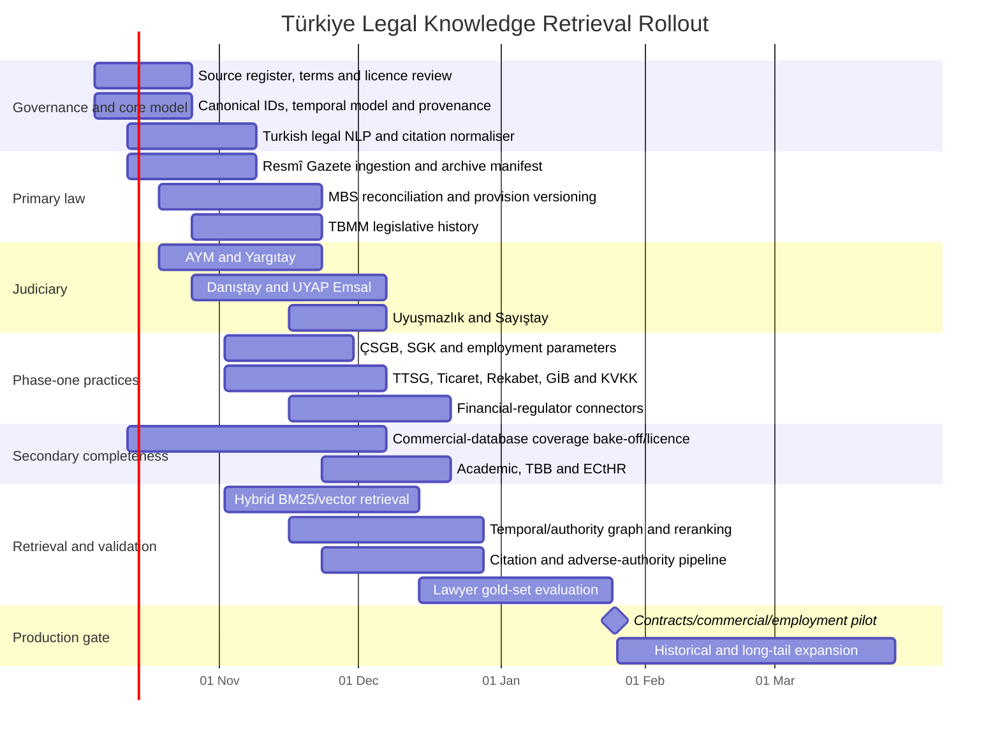

# Türkiye-First Legal AI: Knowledge Retrieval, Source, Freshness and Ingestion Plan

**Research date:** 4 October 2026  
**Initial practice focus:** contracts, commercial disputes and employment law  
**Design objective:** maximise legal-source completeness, temporal correctness, traceability and retrieval quality while keeping ingestion economically sustainable.

## Executive summary

A production legal assistant for Türkiye should **not** be built around a single legal database or around vector search over a pile of PDFs**.** Its knowledge layer should be built as a source hierarchy with four distinct layers:

1. **Authoritative primary law:** Resmî Gazete, Mevzuat Bilgi Sistemi, TBMM legislative material and official regulator publications.
2. **Authoritative/primary judicial material:** Anayasa Mahkemesi, Yargıtay, Danıştay, UYAP Emsal, Uyuşmazlık Mahkemesi and, where relevant, Sayıştay.
3. **Practice-specific official material:** ÇSGB/SGK for employment; Ticaret Bakanlığı, Türkiye Ticaret Sicili Gazetesi, Rekabet Kurumu, GİB, KVKK and financial regulators for commercial work.
4. **Secondary/completeness material:** at least one properly licensed Turkish commercial legal database, followed by academic literature, bar-association material and carefully licensed news/change signals.

Resmî Gazete is the indispensable **event ledger** of Turkish published law. Its official site provides issues back to 7 February 1921 and must be treated as the immutable publication source rather than merely another search database. The system must explicitly handle *mükerrer* issues; multiple supplementary issues can be published on the same date. citeturn15search1turn15search6turn19search9

The Cumhurbaşkanlığı Mevzuat Bilgi Sistemi, by contrast, is the indispensable **consolidated-current-text source**: its official application describes consolidated versions of laws, presidential decrees, regulations, circulars and post-2004 communiqués, including incorporated amendments. Therefore the correct architecture is **RG event → amendment extraction → MBS reconciliation**, not choosing one of the two. citeturn15search8

TBMM is necessary for statutory interpretation because the parliamentary system exposes bill/proposal stages, texts, commission reports and committee minutes. Its commission-report system covers material from the 21st legislative period onwards, and current bill pages expose the progression from proposal through committees to enactment. citeturn21search1turn21search8turn21search9turn21search11

The judicial corpus must also be plural. The AYM, Yargıtay and Danıştay operate independent official decision databases; UYAP Emsal additionally exposes, among other categories, regional appellate civil decisions (*Bölge Adliye Mahkemesi/BAM*). Uyuşmazlık Mahkemesi and Sayıştay provide separate specialised decision corpora. citeturn14view2turn13search0turn13search4turn13search5

Most importantly, the ranking model must **not import an American “precedent score” into Turkish law**. For example, the Constitution expressly provides that AYM decisions bind legislative, executive and judicial bodies, administrative authorities and natural and legal persons; Danıştay's statutory framework gives specific legal effect to *İçtihatları Birleştirme Kurulu* decisions. Ordinary case-law relevance, appellate hierarchy, an unification decision, an AYM decision and mere citation frequency are therefore different things and must remain different metadata features. citeturn17search4turn18search2

My recommended production policy is:

| Class | Meaning | Rule |
|---|---|---|
| **M0 – mandatory core** | The product cannot safely answer Turkish-law questions without it | RG, MBS, TBMM, AYM, Yargıtay, Danıştay, UYAP Emsal |
| **M1 – mandatory phase-one** | Required for contracts/commercial/employment quality | TTSG; ÇSGB; SGK; Ticaret Bakanlığı; Rekabet; GİB; KVKK; relevant financial regulators; TBB |
| **M2 – operationally mandatory** | Not a source of law, but needed to close official-corpus coverage gaps | At least one licensed commercial legal database with contractual machine-use rights |
| **C – conditional mandatory** | Becomes mandatory when the corresponding sub-domain is enabled | SPK, BDDK, TCMB, MASAK, KİK/EKAP, EPDK, TÜRKPATENT, municipalities, etc. |
| **O – enrichment** | Valuable interpretation/discovery source; never substitutes for primary law | Academic material, local bars, licensed books/commentaries, news |

The attached knowledge-graph brief correctly calls for separating **ontology/schema, populated public knowledge, private matter instances and derived retrieval indexes**, and for retaining temporal identity, exact evidence and provenance rather than flattening all of these into embeddings. That distinction should be preserved in the retrieval platform. fileciteturn0file0

The most important engineering principle is consequently:

> **Store the authoritative artefact once; version legal meaning explicitly; derive search representations many times.**

## Source inventory and prioritisation

The following inventory is intended to be **complete at the national-source-family level for the first release**. Municipal bodies, university regulations, sectoral agencies and professional bodies form an open-ended long tail; they should be represented by parameterised source families rather than pretending that a static list of thousands of URLs is “complete”.

**Difficulty:** L = low, M = moderate, H = high, VH = very high.  
“Open” below means public browser access; it **does not mean permission for unrestricted bulk crawling, model training or redistribution**. Every source requires an independently stored licence/terms determination before production ingestion.

| Group / source | Owner and URL(s) | Access / acquisition | Available legal data | Publication/update behaviour | Restrictions / ingestion difficulty | Priority |
|---|---|---|---|---|---|---|
| **Official gazette – T.C. Resmî Gazete** | Cumhurbaşkanlığı Genel Sekreterliği, Hukuk ve Mevzuat Genel Müdürlüğü. `https://www.resmigazete.gov.tr/` | Open HTML + official PDF; governed crawler/download. No public bulk API verified | Laws, presidential decrees/decisions, regulations, communiqués, regulator decisions, AYM/selected judicial decisions, appointments, notices, tenders, official parameters | Daily when an issue is published; *mükerrer* issues may occur the same day; archive from 07-02-1921 citeturn15search1turn19search9 | Terms/copyright notice applies; ingest official artefact + metadata, not merely HTML rendering. Historical scans/OCR make backfill harder. **M current / H historical** | **M0** |
| **Consolidated legislation – Mevzuat Bilgi Sistemi** | Presidency. `https://www.mevzuat.gov.tr/` | Open web/download interfaces; no documented public bulk API verified during this research | Consolidated statutes, decrees, regulations, presidential decisions/general circulars, communiqués; amendment-incorporated current text | Updated when legislation changes; the official app describes downloaded legislation being updateable and consolidated texts being maintained citeturn15search8 | Must not treat consolidated current text as complete historical version history. Reconstruct versions from RG and reconcile. **H** | **M0** |
| **Legislative history – TBMM** | Türkiye Büyük Millet Meclisi. `https://www.tbmm.gov.tr/` | Open query interfaces, HTML and PDFs; controlled incremental crawler | Bills/proposals, texts, commission reports, enactment linkage, committee minutes, plenary materials | Session/event-driven; proposals tracked from submission to outcome citeturn21search1turn21search9turn21search11 | PDFs and historical format changes; legislative material is interpretive context, not enacted law until enacted/published. **M–H** | **M0** |
| **Constitutional Court – AYM** | Anayasa Mahkemesi. `https://kararlarbilgibankasi.anayasa.gov.tr/` | Open searchable database; query/crawl after terms review | Individual applications, constitutional review, political-party and other constitutional decisions; rights, remedies, legislation references, citations | Continuous/irregular publication; search corpus contains current 2026 decisions citeturn1search0turn1search9 | AYM itself warns database text can receive editorial corrections: keep snapshots and re-check recently published decisions. **M–H** citeturn1search1 | **M0** |
| **Court of Cassation – Yargıtay** | Yargıtay Başkanlığı. `https://karararama.yargitay.gov.tr/` | Open search; no public bulk API verified | Civil/criminal chamber decisions, General Assemblies, E/K numbers, dates, decision text | Continuous/irregular | Search-oriented interface; chamber restructuring and changing work allocation require temporal institution mapping. Current work-allocation decisions are separately published. citeturn1search12turn19search4 **H** | **M0** |
| **Council of State – Danıştay** | Danıştay Başkanlığı. `https://karararama.danistay.gov.tr/` | Open search/download; no public bulk API verified | Administrative/tax decisions, chamber/board, E/K, dates, legislation relations; exemplary decisions | Continuous/irregular; the indexed database exposes hundreds of thousands of documents and structured filters citeturn2search1turn2search2 | Query-driven interface; authority type and board/chamber must be preserved. **H** | **M0** |
| **UYAP Emsal** | T.C. Adalet Bakanlığı Bilgi İşlem Genel Müdürlüğü. `https://emsal.uyap.gov.tr/` | Open public search | BAM civil decisions, civil courts and other published *emsal* decisions; E/K/date/unit fields | Continuous/irregular | Public *emsal* corpus is not the same thing as all UYAP case files. Public site exposes BAM/court categories. citeturn14view2 **H** | **M0** |
| **UYAP Avukat Portal – private matter source** | Ministry of Justice. `https://avukat.uyap.gov.tr/` | Authenticated, lawyer-authorised access only | A lawyer's represented files, procedural documents, file stages and filings | Transactional/current | **Never bulk-ingest into the public corpus.** Use only an explicit user-authorised tenant connector governed by portal terms. Portal permits lawyers to access represented case files and documents. citeturn2search5turn2search8 **VH governance / M technical** | Private-matter connector |
| **Uyuşmazlık Mahkemesi** | Uyuşmazlık Mahkemesi. `https://kararlar.uyusmazlik.gov.tr/Default` | Open view/download | Jurisdiction/conflict decisions, E/K/date, complete decision text | Irregular | Valuable for forum/jurisdiction routing; decisions resolve judicial/administrative jurisdiction conflicts definitively. citeturn13search0turn17search2 **M** | M1 general / C phase-one |
| **Sayıştay** | T.C. Sayıştay Başkanlığı. `https://www.sayistay.gov.tr/KararlarDaire`, `https://www.sayistay.gov.tr/KararlarTemyiz` | Open structured search/HTML | Chamber and Appeal Board decisions, public-loss/personnel/procurement issues, dissent, public entity, fiscal year | Ongoing/irregular; 2025–2026 decisions are currently exposed citeturn13search2turn13search4turn13search5 | Specialised authority; preserve decision stage and public-entity type. **M** | C |
| **Türkiye Ticaret Sicili Gazetesi** | TOBB. `https://www.ticaretsicil.gov.tr/` | Free search after account/login; certified copies paid; negotiate feed for systematic ingestion | Company-registration notices, incorporation, capital, directors/representation, mergers, liquidation, sample announcement texts, title lookup | Very frequent/business-day publication | Site says notices from 1957 onwards are available and that approved copies can be purchased; footer reserves rights. Do **not** assume bulk republication rights. citeturn14view3 Entity resolution + PDFs make this **VH** | **M1 commercial** |
| **MERSİS** | T.C. Ticaret Bakanlığı. Linked from TTSG/MERSİS ecosystem. citeturn14view3 | Authenticated service; use authorised query/integration or formal partnership, not credential scraping | Company/registry identities and registration workflows | Transactional | Access-controlled registry; use as identity/on-demand verification rather than indiscriminate public corpus. **VH** | C / on-demand |
| **Çalışma ve Sosyal Güvenlik Bakanlığı** | `https://www.csgb.gov.tr/` | Open HTML/PDF; monitor announcements and data pages | Labour regulations, circulars/announcements, minimum wage, severance ceiling, union statistics, collective bargaining information, administrative penalty figures | Monthly, annual and event-driven. Current 2026 labour statistics explicitly carry effective periods. citeturn20search2turn20search3turn20search5 | Store parameters with validity intervals, never as unversioned constants. **M** | **M1 employment** |
| **SGK** | Sosyal Güvenlik Kurumu. `https://www.sgk.gov.tr/` | Open webpages/PDFs; institutional pages + circulars | Social-security circulars, notices, contribution parameters, guidance | Event-driven/annual/irregular; SGK publishes current-year contribution values and guidance citeturn20search10 | Circulars may be operationally critical without changing statutory text. **M–H** | **M1 employment** |
| **KVKK** | Kişisel Verileri Koruma Kurumu. `https://www.kvkk.gov.tr/Icerik/5419/Kurul-Kararlari` | Open HTML/PDF; crawl decision index | Board decisions, principle decisions, guidance, public announcements, legislation | Irregular but frequent; 2026/current decisions appear on the official decision pages citeturn3search0 | Critical cross-domain regulatory source; preserve whether item is a decision, summary, principle decision or guidance. **M** | **M1** |
| **Rekabet Kurumu** | `https://www.rekabet.gov.tr/` | Open decision search; HTML/PDF | Competition Board decisions, investigations, merger/control material, legislation | Irregular, high business relevance; official site supports filtering decisions by text, type, date and number citeturn3search3 | Decisions can be fact-heavy and redacted; needs party/market/conduct NER. **M–H** | **M1 commercial** |
| **Ticaret Bakanlığı** | `https://ticaret.gov.tr/` | Open webpages/PDFs | Commercial, consumer, e-commerce, customs and internal-trade regulations/guidance | Frequent/event-driven; current 2026 consumer and e-commerce material is published online citeturn7search14turn7search16 | Distinguish statutory/regulatory source from ministry explanation. **M** | **M1 contracts/commercial** |
| **GİB** | Gelir İdaresi Başkanlığı. `https://gib.gov.tr/mevzuat` | Open web/PDF | Tax legislation, circulars, communiqués, published private rulings (*özelge*) and guidance | Frequent | Özelge/circular type and taxpayer-confidentiality/redaction context must remain explicit; VUK provides for published circular/private-ruling material. citeturn6search3turn6search5turn6search8 **M–H** | **M1 commercial** |
| **SPK** | Sermaye Piyasası Kurulu. `https://mevzuat.spk.gov.tr/` | Open structured regulatory database | Capital-markets regulations, communiqués, Board decisions, circulars | Frequent/event-driven; official system exposes dated 2026 decisions and related materials citeturn3search1 | Strongly structured; linking regulation/decision/circular useful. **M** | C, M1 for capital-markets clients |
| **BDDK** | Bankacılık Düzenleme ve Denetleme Kurumu. `https://www.bddk.org.tr/Mevzuat` | Open web/PDF | Banking, payment-card, leasing/factoring/finance regulations; Board decisions, drafts/repealed material | Frequent/event-driven | Preserve published vs unpublished/repealed status where exposed; source categories include multiple financial regimes. citeturn4search13 **M** | C / high-value commercial |
| **TCMB** | Türkiye Cumhuriyet Merkez Bankası. `https://www.tcmb.gov.tr/` | Open web/PDF/data | Payment-system legislation, regulations/notices; official financial parameters/data | Daily for certain data, event-driven for legal material | Treat market/rate data separately from normative material, each with effective timestamp. citeturn5search1 **M** | C / finance |
| **MASAK** | Hazine ve Maliye Bakanlığı, MASAK. `https://masak.hmb.gov.tr/mevzuat` | Open HTML/PDF | AML/CFT legislation, general communiqués, guides, forms, freezing/sanctions-related material | Event-driven; guidance is periodically updated citeturn7search2turn7search8 | Extremely high consequentiality: update immediately and retain superseded guides. **M** | C / high priority commercial-finance |
| **KİK / EKAP** | Kamu İhale Kurumu. `https://www.ihale.gov.tr/`, `https://ekap.kik.gov.tr/` | Public web plus authenticated procurement services | Procurement legislation, public procurement bulletins, Board material, objection decisions, tender data | Daily/event-driven | Public and account-bound areas require different policies. Official EKAP tooling exposes tender and Board/legislation content. citeturn4search6 **H** | C |
| **TÜRKPATENT** | Türk Patent ve Marka Kurumu. `https://www.turkpatent.gov.tr/tr/mevzuat` | Open web/PDF; decision availability varies | IP legislation, institutional decisions/guidance, YİDK-related material | Event-driven | Full decision corpus/access should be assessed separately before promising coverage. citeturn7search6turn7search15 **M–H** | C |
| **EPDK** | Enerji Piyasası Düzenleme Kurumu. `https://www.epdk.gov.tr/` | Open pages/PDF/RG cross-links | Energy-market Board decisions, regulations, tariffs | Frequent/event-driven; EPDK decisions also appear in RG citeturn19search5 | Crawler + RG reconciliation. **M** | C |
| **Türkiye Barolar Birliği** | TBB. `https://www.barobirlik.org.tr/`, `https://www.barobirlik.org.tr/DisiplinKararlari` | Open web/PDF | Professional rules, disciplinary decisions, tariffs, notices, practice materials | Irregular/event-driven; current disciplinary decision material is published online citeturn8search0turn8search4 | Authoritative for professional-governance material, not a substitute for statutes/case law. **M** | **M1 professional compliance** |
| **Local bar associations** | İstanbul, Ankara, İzmir and others; official bar sites | Open web/publications; partnership for archives | Training notes, commission materials, sample forms, local practice guidance, some case-law collections | Irregular | Commentary/practice material; rights vary by author/publication. Index metadata/link unless rights permit full text. citeturn8search9turn8search14 **H collectively** | O |
| **LEXPERA** | On İki Levha / LEXPERA. `https://www.lexpera.com.tr/` | Paid subscription; **negotiate API/feed/SFTP and AI-use rights** | Consolidated legislation, case law including BAM, regulator decisions, literature/editorial material, versioning | Continuously/daily maintained; site showed **5,005,708** case-law records in current crawl and 2026 BAM decisions. citeturn22search11 | Never crawl behind subscription outside licence. Machine ingestion, embeddings, derivative indexes and redistribution must be contractual. **L technical / H contractual** | Candidate **M2** |
| **Kazancı** | Kazancı legal publishing/database. `https://www.kazanci.com/` | Paid; partnership/licence | Large legislation/case-law/commentary collection | Vendor-maintained/daily claims | Treat counts/coverage as vendor claims and run empirical coverage test. Machine use requires licence. citeturn9search2 | Candidate M2 |
| **Legalbank** | Legalbank. `https://legalbank.net/`, `https://mevzuatvekararlar.legalbank.net/` | Paid/login; partnership licence | Case law, legislation, petitions/documents and library material; current pages include 2026 Yargıtay decisions and update indexes citeturn22search3turn22search8 | Ongoing vendor updates | Subscription ≠ ingestion licence. **L technical / H contractual** | Candidate M2 |
| **Lebib Yalkın / Mevbank Neo** | Lebib Yalkın. `https://lebibyalkin.com.tr/` | Paid/product licence; partnership | Legislation, case law, compliance tracking, expert content | Very current: homepage indexed the 3 October 2026 RG issue and vendor describes live update notifications. citeturn22search0turn22search2 | Particularly useful for regulatory/compliance change detection; contractual machine-use rights required. | Candidate M2 |
| **DergiPark** | TÜBİTAK ULAKBİM platform. `https://dergipark.org.tr/` | Open metadata; OAI-PMH exists for journals; full-text rights determined per journal/article | Turkish law journals, articles, abstracts, citations | Article/journal-driven | OAI is preferable to scraping. Licence varies: examples use Creative Commons but not uniformly; store licence at article level. citeturn11search2turn11search3 **M** | O, high-value interpretation |
| **TR Dizin** | TÜBİTAK ULAKBİM. `https://search.trdizin.gov.tr/` | Open discovery/search; full text varies | National citation/index metadata, journals/articles | Continuous/indexed batches | Useful metadata/citation graph; some records do not expose full text. citeturn11search14turn11search15 **M** | O |
| **YÖK Ulusal Tez Merkezi** | Yükseköğretim Kurulu. `https://tez.yok.gov.tr/UlusalTezMerkezi/` | Public discovery; thesis access varies | LL.M./PhD theses, abstracts, bibliographies | Institutional submissions | Verify current bulk/full-text reuse terms before ingestion; prefer metadata/linking where unclear. **H** | O |
| **ECtHR HUDOC** | European Court of Human Rights / Council of Europe. `https://hudoc.echr.coe.int/` | Open search/export/RSS capabilities | ECtHR judgments, decisions, communicated cases, advisory opinions, Commission and Committee material | Ongoing | Turkish translations exist but translation status can vary; always retain authoritative-language/version metadata. citeturn12search0turn12search2turn12search3 **M** | M1 cross-cutting |
| **ILO NORMLEX** | International Labour Organization. `https://normlex.ilo.org/` | Open web | Conventions, recommendations, ratification/supervisory material | Event-driven | Primary international employment-law context; validate licence/bulk mechanism before full mirroring. | M1 employment enrichment |
| **Municipality/local authority family** | Official `*.bel.tr` sites; metropolitan/district councils and related bodies | Highly fragmented; API/feed where offered, otherwise approved crawler/on-demand | Council (*meclis*) and executive-board decisions, local regulations, tariffs, plans, zoning and notices | Municipality-specific | No single nationwide corpus should be assumed complete. Geography should be a query parameter; local-law coverage must be disclosed. **VH** | C / on-demand |
| **News/change signals** | Official institution newsrooms first; licensed publishers such as AA/business press second | RSS/feed/API/licence; avoid unauthorised archival copying | Announcements, regulatory-change reporting, litigation/business context | Minutes/hours | **Never rank news as legal authority.** Use it to trigger source re-checks and discovery; retain full text only when licensed. **M technical / H licensing** | O |

A commercial database should therefore be selected by a **coverage bake-off**, not by marketing counts. Run 500–1,000 stratified known-item tests across Yargıtay, BAM, BİM, AYM, Danıştay and the first three practice areas; measure unique decisions, publication delay, metadata accuracy and contractual rights to embed/index the content. LEXPERA's current corpus, for example, visibly contains BAM decisions unavailable from a high-court-only strategy, which illustrates why this layer can materially improve recall. citeturn22search11

For historical coverage, there is one immediate gap to recognise: the RG portal starts at **7 February 1921**, while the broader ontology brief calls for coverage beginning in 1920. The 1920–early-1921 period therefore needs a separate audited archival project rather than being silently represented as covered. citeturn15search1

## Freshness and ingestion policy

Freshness should be managed as an explicit **service-level objective**, not as “we run the crawler nightly”. Four different notions must be recorded:

`publication_lag = first_successful_ingest_at − source_publication_at`

`coverage_lag = now − last_successful_source_scan`

`legal_validity = effective_from … effective_to`

`system_knowledge_time = first_seen_at … superseded_in_system_at`

Those clocks solve different problems. A provision published yesterday but effective next month is not currently applicable; an old provision may still be the correct law for a 2019 event; a court decision dated March may first appear online in June. Unknown dates must remain `null`, never be guessed.

**Recommended production freshness matrix**

| Source class | Incremental check | Staleness SLO | Rolling reconciliation | Full/rebuild policy | Failure behaviour |
|---|---:|---:|---|---|---|
| **Resmî Gazete** | Every **15 min** during high-probability publication window; hourly thereafter; always check ordinary + *mükerrer* | **30 min** from detectable publication | Re-fetch manifests for last **3 days daily**, last **30 days weekly** | Monthly issue-number/date/hash reconciliation; never routinely re-embed unchanged docs | >60 min: alert P1; “current law” answers carry freshness warning |
| **MBS – phase-one laws** | RG-triggered targeted pull + **2-hour** delta scan | **4 h** after detectable consolidated change | Nightly checksums for watched instruments | Weekly metadata reconciliation; quarterly broad hash audit | If stale, answer from RG change event and flag consolidation pending |
| **MBS – remaining legislation** | **6 h** | **12 h** | Weekly | Quarterly | Degrade “current” confidence |
| **TBMM** | Hourly while Parliament is active; **6 h** otherwise | **2 h** for relevant proposal/report change | 7-day rolling refresh | Monthly identifiers/status reconciliation | Interpretation/history feature degrades; enacted law still comes from RG |
| **AYM/Yargıtay/Danıştay/UYAP** | Every **4 h** | **12 h** from web publication where detectable | Revisit previous **90 days weekly** | Monthly ID/count reconciliation, quarterly deep audit | “Recent case-law coverage delayed” banner if >24 h |
| **Uyuşmazlık/Sayıştay** | **12 h** | **24 h** | 90-day weekly rolling | Quarterly | Source-specific warning |
| **Tier-A regulators: KVKK, Rekabet, SPK, BDDK, TCMB, MASAK, GİB, ÇSGB/SGK** | **1 h** index/page watch; RG event linkage | **4 h** | 30-day weekly | Monthly full source-manifest audit | P1 alert; suppress unsupported claim of “latest” |
| **Other regulators** | **6 h** | **24 h** | 30-day weekly | Quarterly | Source warning |
| **Critical employment/calculation parameters** | Event/RG-trigger + hourly on watched pages | **4 h** | Daily effective-date validation | Recompute dependent derived tables on change | Disable calculator if source/effective date unresolved |
| **Licensed commercial database** | Vendor API/feed every **1–4 h**, subject to contract | **12 h** | Vendor delta reconciliation weekly | Never brute-force re-download; quarterly ID reconciliation | Fall back to official sources; disclose reduced secondary coverage |
| **TBB** | **6 h** | **24 h** | 30-day weekly | Quarterly | Professional-regulation warning |
| **Local bars / academic** | Daily / weekly respectively | **2 d / 7 d** | Monthly | Semi-annual | No effect on primary-law currency |
| **Monitored municipality** | **6–24 h** according to matter relevance | **24 h** | 30-day monthly | Quarterly | Explicit municipality-coverage warning |
| **Unmonitored municipalities** | On demand + monthly discovery | No global completeness claim | On demand | Annual registry refresh | Report “not continuously monitored” |
| **News signals** | **5–15 min** feed polling | **1 h** | None | No permanent corpus unless licensed | News outage must never make legal corpus unavailable |

The key efficiency optimisation is **event-driven targeted refresh**. A newly published RG amendment should enqueue only the affected instruments, provisions, regulator sources and dependent indexes. Re-embedding the entire Turkish Code of Obligations because one sentence changed is wasteful; generate a new provision version and re-index the affected provision, surrounding structural context and dependency links only.

**Priority watchlists for phase one** should be substantially more aggressive than the rest of the legal corpus.

For contracts/commercial disputes, the watchlist should include the Turkish Code of Obligations, Commercial Code, Code of Civil Procedure, enforcement/bankruptcy legislation, mediation, private international law where relevant, consumer/e-commerce law, company/registry material and the civil/commercial chambers, HGK/BAM corpus plus Ticaret Bakanlığı, Rekabet, KVKK and GİB. Financial regulators are activated when the client's issue enters banking, securities, payments, AML or regulated finance.

For employment, the watchlist should include Labour Law, the surviving severance-pay provision of former Labour Law No. 1475, Social Insurance and General Health Insurance Law, Occupational Health and Safety Law, Trade Unions and Collective Bargaining Law, Labour Courts Law, mediation, SGK circulars, ÇSGB parameters, relevant Yargıtay/BAM decisions and international/constitutional material. The Ministry's current labour datasets explicitly publish validity periods for minimum-wage information, demonstrating why such parameters should be modelled as versioned values rather than static configuration. citeturn20search2turn20search3

**Ingestion design by source family**

| Source family | Preferred acquisition | Parsing / OCR | Legal NER and linking | Deduplication / versioning |
|---|---|---|---|---|
| RG / MBS | Official HTML/download/PDF; hash every artefact | HTML first; PDF layout parser; OCR only for scan-only archive | Instrument type/no.; RG date/no.; amendment target; article/paragraph; commencement; repeals; transitional clauses | RG artefact immutable. MBS snapshots are derived consolidations. Produce provision versions rather than overwriting |
| Parliament | HTML metadata + official PDFs | Layout-aware PDF parser | Proposal no.; legislative period; MPs; committees; articles; affected law/provision; enactment no. | Canonical proposal ID; link proposal → report → final law → RG |
| Courts | Official decision HTML/download endpoints | Preserve structural headings; OCR PDF only when needed | Court, chamber/board, E/K/B no., application no., decision date, parties/roles, procedural stage, disposition, citations, dissent | Official identifiers first; hash second. Never merge two decisions solely because text is similar |
| Regulators | Official decision index/RSS if provided; HTML/PDF | HTML/PDF | Board, decision no., meeting/date, regulated entity, statutory basis, measure/sanction, effective date | Agency + decision no./date canonical identity; RG copy linked as another manifestation |
| Commercial vendors | Contractual API/SFTP/feed only | Prefer vendor structured payload | Preserve vendor taxonomy but map to canonical entities | Cross-source clustering without destroying provenance; each vendor manifestation retained |
| Academic | OAI-PMH/RSS/metadata APIs; full text only under licence | PDF/article XML when permitted | author, institution, journal, DOI/identifier, legal concepts, statutes/cases cited | DOI/metadata identity + content hash |
| Bars | RSS/API where present, otherwise permitted crawler | HTML/PDF/forms | issuing body, author, type, practice area, referenced law | Preserve author/publication rights metadata |
| Municipalities | API/feed where available, targeted official-site crawler otherwise | Highly variable HTML/PDF/OCR | municipality, council/body, decision no., location, zoning parcel where relevant, legal basis | jurisdiction + body + decision/date/no.; retain territorial validity |
| News | Licensed API/RSS | HTML/feed text subject to licence | entities, legislation mentions, decision references | Story clustering only; never merge into legal authority |
| Private matters/UYAP | User-authorised authenticated connector or customer import | Native DOCX/PDF/email extraction + OCR | person/company, contextual role, event, allegation, finding, document/passages | Tenant-scoped IDs; no public deduplication based on private facts |

The canonical metadata envelope should be shared by every object:

```text
source_id
source_owner
source_document_id
canonical_legal_id
document_type
jurisdiction
institution_id
court_or_board
chamber
proceeding_id
decision_id
instrument_id
provision_id
provision_version_id

title_original
text_original
text_normalised_for_search
language
citation_aliases

decision_date
publication_date
official_gazette_date
effective_from
effective_to
finality_date

source_first_seen_at
retrieved_at
source_last_checked_at
system_version_from
system_version_to

source_url
official_locator
page_or_paragraph_locator
content_hash
raw_artifact_hash
parent_artifact_id

parser_version
ocr_engine_version
ocr_confidence
extraction_model_version
extraction_confidence
human_review_status

licence_class
permitted_uses
terms_reviewed_at
redistribution_allowed
embedding_allowed

supersedes_id
amends_id
repeals_id
cites_ids[]
topic_ids[]
practice_area_ids[]
```

This should be **bitemporal**. `effective_from/effective_to` answers *what law applied at time T*; `system_version_from/system_version_to` answers *what the platform knew at time T*. A database `updated_at` field is not an acceptable substitute.

For Turkish language processing, preserve the exact official text and build separate search representations. Use Unicode NFC; Turkish-aware casing for `i/İ` and `ı/I`; preserve diacritics; create a de-accented/de-ASCII alias field only for recall; normalise spacing and apostrophe variants; maintain citation variants such as `m.`, `md.`, `madde`, `f.`, `E.`, `K.`, `HGK`, `BAM`, `BİM`, `İBK`. Morphological lemmas should be a supplementary search field, not a replacement for exact legal wording. Aggressive stemming is particularly dangerous for legal quotations.

Historical material deserves a separate pipeline. Modern OCR quality thresholds should be much stricter for citations, numbers and dates than for generic text. Pre-Latin-script Ottoman Turkish material should not be silently transliterated into a supposedly authoritative modern Turkish text; retain image evidence and specialist transcription/review.

**Deduplication rule:** exact legal identity beats textual similarity. Use official instrument/decision identifiers first, source-specific IDs second, cryptographic hashes third and MinHash/similarity only to create candidate duplicate clusters. A near-identical BAM decision is still a different legal decision.

**Provenance rule:** every retrievable passage must point back to `(source, artefact hash, source version, exact page/paragraph, acquisition time, extraction version, review state)`. Public accessibility should never be equated with permission for bulk acquisition or redistribution; this separation is also explicit in the supplied architecture brief. fileciteturn0file0 Commercial commentary, editorial summaries and database enrichment require contractual rights even when the underlying statute or judgment is separately available from an official source.

## Retrieval architecture

The recommended architecture is **hybrid search with temporal and authority-aware reranking plus a bounded legal graph**.

```text
                         ┌─────────────────────────────┐
                         │ Lawyer question / matter    │
                         └──────────────┬──────────────┘
                                        │
                       intent + entities + event date
                                        │
                 ┌──────────────────────▼─────────────────────┐
                 │ Query interpretation                      │
                 │ concepts • citations • issues • parties   │
                 │ jurisdiction • practice • date constraints│
                 └─────────┬──────────────────────┬───────────┘
                           │                      │
                 lexical candidates        semantic candidates
                 BM25 / citations           vector retrieval
                           │                      │
                           └──────────┬───────────┘
                                    RRF
                                     │
                       structured legal filtering
                    authority • validity • permissions
                                     │
                              graph expansion
                    provision history • cites • amends
                    court/chamber • issue • proceedings
                                     │
                         legally-aware reranker
                                     │
                ┌────────────────────┴──────────────────┐
                │                                      │
       supportive evidence                    adverse/conflicting pass
                │                                      │
                └────────────────────┬──────────────────┘
                                     │
                         evidence-grounded answer
                 sentence citations + exact source links
```

The storage model should contain four security/semantic planes:

| Plane | Purpose | Recommended storage |
|---|---|---|
| **Raw source lake** | Immutable HTML/PDF/XML/API payloads, hashes, licences | Object storage/WORM-capable store |
| **Canonical legal store/graph** | Legal identities, versions, citation/amendment relationships, institutions | PostgreSQL + RDF/Jena/Fuseki where graph traversal adds value |
| **Derived retrieval indexes** | BM25, Turkish normalisations, vectors, citation fields | OpenSearch |
| **Private matter stores** | Client documents, evidence, matter graph and derived indexes | Tenant/workspace-isolated on-prem storage and indexes |

Public authority IDs may be referenced from the private matter graph, but the public graph must never contain reverse links revealing clients or matters. That is particularly important for on-prem and disconnected deployments described in the supplied platform architecture. fileciteturn0file0

**Chunking should follow legal units, not arbitrary token windows.** Legislation should index instrument, article, paragraph/subparagraph and version; judgments should preserve at least submissions, factual findings, legal assessment/reasoning, disposition and dissent where detectable. The question “the court said X” cannot safely be answered from a chunk that actually comes from the claimant's submissions.

The candidate stage should retrieve independently from:

```text
BM25_original_Turkish
BM25_normalised_Turkish
exact_citation_index
semantic_vector_index
structured_case_metadata
bounded_graph_neighbours
```

A sensible initial candidate budget is approximately `300 lexical + 300 semantic + 50–100 graph/citation` items, deduplicated via reciprocal-rank fusion before reranking. Exact values should subsequently be learned from the evaluation set.

The second-stage reranker should use features such as:

| Signal | Interpretation |
|---|---|
| Semantic issue similarity | Does the passage actually address the legal question? |
| Exact citation match | Does it discuss the same provision/decision cited by the lawyer? |
| Temporal applicability | Was this provision version legally applicable on the event date? |
| Court/decision authority | Court, board/chamber, decision type and legally established effect |
| Procedural posture | Appeal/reversal/merits/admissibility/interim/finality context |
| Factual comparability | Same legally material facts, not merely lexical similarity |
| Treatment signal | Cited, followed, distinguished, criticised, overruled/replaced where actually evidenced |
| Official-source quality | Primary official text preferred over vendor/commentary copy |
| Currency | Useful only after temporal applicability/authority are satisfied |
| Review/provenance quality | Human-reviewed extraction and exact locator preferred |

Do **not** collapse those signals into a naïve “precedent strength” metric. AYM decisions have constitutionally defined binding force, while Danıştay unification decisions have explicit binding effects on specified bodies. That is categorically different from saying a Yargıtay decision has many citations. citeturn17search4turn18search2

**Recency should be asymmetric.**

For legislation:

```text
event-date applicability > latest publication
```

If a contract was terminated on 14 June 2020, the retriever should first select the version valid on 14 June 2020. The 2026 text is not “better” because it is newer.

For jurisprudence:

```text
legal authority + factual/issue fit + procedural posture
    > recency
```

Recency can weakly boost recent consistent interpretation, but must not suppress an older still-operative *içtihadı birleştirme* decision or relevant constitutional holding.

For regulators:

```text
effective status > most recently uploaded file
```

A recently uploaded historical circular must not outrank a currently effective rule merely because `retrieved_at` is newer.

**Citation resolution** should operate as a dedicated subsystem. Normalise variants such as:

```text
6098 s. TBK m. 27
TBK 27
6098 sayılı Kanun m.27
Yargıtay 9. HD. E.2025/... K.2026/...
AYM B. No: ...
RG 03.09.2026/33359
```

to stable canonical IDs. Retain the literal citation occurrence as evidence; do not infer endorsement merely because decision A cites decision B.

**Adverse-authority retrieval should be mandatory**, not an optional prompt trick. After identifying the user's apparent argument, issue a separate retrieval branch for opposite dispositions, contrary interpretations, distinctions, rejected arguments and temporally superseding authorities. The answer should expose “supporting authorities” and “authorities requiring caution” independently.

**Hallucination containment** should happen before, during and after generation:

- A substantive legal proposition may enter the final answer only if an evidence object supports it.
- Quotes must pass an exact-span verifier against the immutable source artefact.
- Provision references must resolve to a specific version.
- Primary official evidence outranks commentary whenever both are available.
- The model must distinguish “I found no matching authority in the indexed corpus” from “no such authority exists”.
- “Current law” answers are blocked or visibly degraded when an M0/M1 source exceeds its staleness threshold.
- Conflicting decisions must not be averaged into a fabricated rule.
- Numerical/deadline computations must expose the rule version, trigger date, exclusions and unresolved inputs.

This is particularly important with privacy. KVKK guidance emphasises lawful processing conditions as well as purpose limitation, proportionality, accuracy/currentness and appropriate retention; public availability is itself not an unlimited processing justification. citeturn16search0turn16search1turn16search3 Public court material should therefore be ingested as officially published/redacted, and the product should never attempt to re-identify pseudonymised parties.

A practical licence classifier should be applied **before indexing**:

```text
OFFICIAL_PRIMARY_REVIEWED
OFFICIAL_PUBLIC_RESTRICTED
OPEN_LICENSE_FULLTEXT
LICENSED_INTERNAL_INDEX
LICENSED_NO_MODEL_TRAINING
METADATA_AND_LINK_ONLY
PRIVATE_TENANT
DO_NOT_INGEST
```

The Cultural Ministry maintains the current Fikir ve Sanat Eserleri Kanunu as the core copyright statute; your legal team should document the precise statutory and contractual basis for each source rather than assuming that the accessibility of the web page establishes all desired AI uses. citeturn21search0

## Rollout plan

The fastest useful release is **not all Turkish law**. It is a legally validated slice in which source provenance, version correctness and citations work end-to-end for the three launch practices.



The recommended deployment sequence is:

| Delivery slice | What must work before moving on | Why |
|---|---|---|
| **Foundation** | Immutable source artefacts, hashes, source registry, canonical identifiers, licence classifier, provision/decision metadata | Prevents expensive re-engineering later |
| **Primary-law MVP** | RG → amendment → provision-version pipeline; MBS reconciliation; exact citation links | Solves the highest-risk “wrong/current version” failure |
| **Judicial MVP** | AYM/Yargıtay/Danıştay/UYAP; E/K resolution; passage segmentation; procedural/disposition metadata | Gives usable research capability |
| **Phase-one practice layer** | Employment and commercial regulators/parameters + TTSG | Makes product materially better than generic case-law search |
| **Commercial completeness layer** | One vendor feed/licence selected from empirical gap analysis | Improves recall without making vendor copy the source of truth |
| **Graph-assisted release** | Version/amendment/citation/institution/issue graph; bounded traversal | Adds useful structure only after populated corpus exists |
| **Historical/long-tail** | 1921+ RG backfill, 1920 gap project, municipalities and lower-value regulators | Expands coverage after current-law reliability is established |

A key architectural decision is to make **offline releases first-class**. For disconnected installations, issue signed corpus bundles containing:

```text
release_id
release_created_at
source_watermark_by_source
raw-artifact manifest + SHA-256 hashes
canonical database delta
OpenSearch lexical/vector delta
public KG delta
licence manifest
known coverage gaps
QA report
previous_release_id
signature
```

This allows an on-premise customer to know exactly which RG issue, decision-publication watermark and regulatory updates are included rather than receiving a vague “October database”.

## Monitoring, QA and actionable next steps

The following are proposed **launch gates**, not claims about current system performance.

| Dimension | Metric | Proposed production target |
|---|---|---:|
| Source freshness | RG publication ingestion lag p95 | **<30 min** |
| Source freshness | Critical regulator lag p95 | **<4 h** |
| Source freshness | Court-publication lag p95 | **<12 h** |
| Availability | Successful M0 scheduled scans | **≥99.9%** |
| RG completeness | Ordinary + *mükerrer* issue manifest coverage | **100%** |
| Provision history | Known amendment correctly attached to affected provision | **≥99.5%** critical-law gold set |
| Temporal QA | Correct provision version for event-date test | **≥99.5%** |
| Identity | Duplicate canonical decisions | **<0.1%**, manually audited |
| Metadata | Court/E/K/date extraction accuracy | **≥99.5%** |
| Citation extraction | Statute/case citation resolution precision | **≥99%** |
| Citation recall | Resolvable citations successfully linked | **≥98%** |
| Evidence | User-visible quotation exact-span accuracy | **100% sampled launch gate** |
| Retrieval | Recall@50 on lawyer gold set | **≥0.90** |
| Retrieval | nDCG@10 on lawyer relevance judgments | **≥0.80** initial target |
| Adverse research | Known contrary authority retrieved@50 | **≥0.90** |
| Source hierarchy | Primary source preferred where duplicate secondary copy exists | **≥99%** |
| Hallucination | Unsupported substantive legal propositions | **<0.5%, target 0 for high-risk answer modes** |
| Coverage honesty | False “no authority exists” statements | **0** |
| Privacy | Cross-tenant/private-public leakage in adversarial tests | **0** |
| Licensing | Content indexed contrary to registered permitted use | **0** |
| Operational integrity | Source schema break detection | **<15 min** for M0 |
| Retrieval latency | Search/rerank p95 excluding LLM generation | **<2 s** target |
| Cost efficiency | Documents unnecessarily re-embedded after unchanged refresh | **<1%** |
| Offline releases | Manifest/hash verification success | **100%** |

Evaluation must use a lawyer-authored test set rather than generic IR benchmarks. At minimum it should contain questions of these types:

| Test | What failure it detects |
|---|---|
| “What version of Article X applied on date Y?” | Temporal/version errors |
| “What changed afterwards?” | Amendment graph failures |
| “Find decisions under comparable facts.” | Semantic/factual retrieval failures |
| “Find decisions against this argument.” | Confirmation bias/adverse recall |
| “Who said this sentence?” | Submission versus judicial-reasoning confusion |
| “What was the disposition?” | Passage/decision-structure errors |
| “Does this decision cite/follow/distinguish X?” | Citation-treatment over-inference |
| “What is the latest applicable rule?” | Freshness/effective-date confusion |
| “No results found—why?” | Coverage-awareness failures |
| “Which client document supports this fact?” | Private evidence/provenance failures |

Run the same queries against four ablations:

```text
A = BM25 only
B = BM25 + semantic
C = hybrid + legal metadata/time
D = hybrid + legal metadata/time + bounded graph
```

That will answer the important product question: **does the knowledge graph actually improve lawyer research, or does it merely make the architecture look sophisticated?** The graph should be retained where it improves version resolution, authority traversal, citation resolution, issue expansion, institutional history or adverse-authority discovery; ordinary full-text/vector retrieval should continue doing the work it performs better.

The immediate execution backlog should be:

| Order | Action | Concrete output |
|---|---|---|
| **Now** | Create the **source registry and rights matrix** for every row above | Owner, URL, owner contact, access mechanism, terms URL, robots state, statutory/licence basis, permitted crawling, embedding, training and redistribution fields |
| **Now** | Contact the Presidency/MBS-RG, Ministry of Justice/UYAP and shortlisted commercial vendors regarding machine access | Determine whether supported feeds/APIs/bulk arrangements can replace brittle crawling |
| **Now** | Freeze canonical identifiers and the bitemporal schema | Prevent downstream search indexes becoming the system of record |
| **Next** | Build RG first, including *mükerrer* detection and immutable PDFs | Authoritative legal event stream |
| **Next** | Build MBS reconciliation and provision-version reconstruction | Correct historical/current-law answers |
| **Next** | Add AYM, Yargıtay, Danıştay and UYAP with a shared decision model | Core jurisprudence retrieval |
| **Next** | Add phase-one regulatory packs: **employment** = ÇSGB+SGK; **commercial** = TTSG+Ticaret+Rekabet+GİB+KVKK | Domain advantage over generic legal search |
| **Next** | Run commercial database bake-off and negotiate machine-use licence | Coverage supplementation without IP risk |
| **Then** | Build hybrid retrieval and lawyer-labelled evaluation before expanding ontology | Measurable retrieval lift |
| **Then** | Introduce bounded authority/provision/issue graph and run ablations | Keep only graph structures that improve measurable outcomes |
| **Then** | Add academic/bar/international enrichment, municipalities on demand and historical backfill | Broader research depth without compromising core freshness |

The product's strongest defensible capability should therefore be **not “we have the most documents” but “for every legal proposition we can tell the lawyer exactly which authoritative text, which version, which court or institution, which passage, which acquisition snapshot and which unresolved coverage limitation supports it.”** The available Turkish official infrastructure makes that feasible: Resmî Gazete provides the authoritative publication chronology, MBS the consolidated legislative view, Parliament the legislative record, the official courts their respective decision corpora, UYAP adds lower/regional *emsal* material, and specialised regulators publish increasingly rich decision and regulatory datasets. citeturn15search1turn15search8turn21search9turn14view2turn13search0

That source-and-provenance discipline is what should sit at the centre of the assistant's retrieval harness.